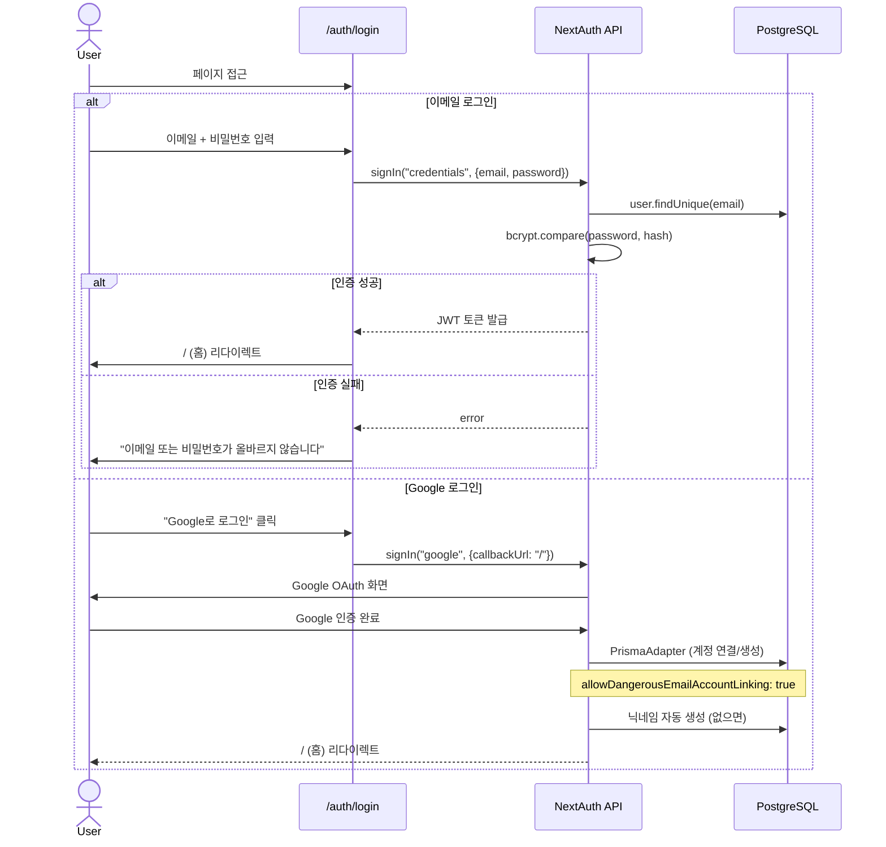
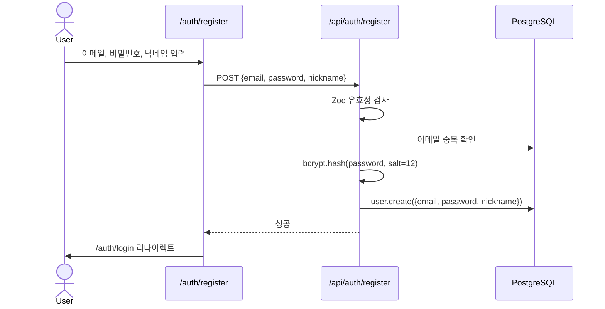
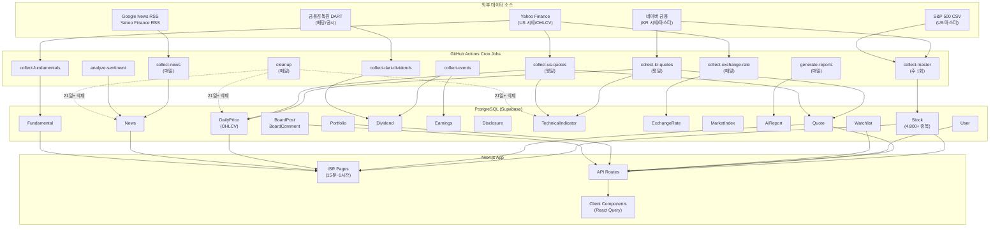
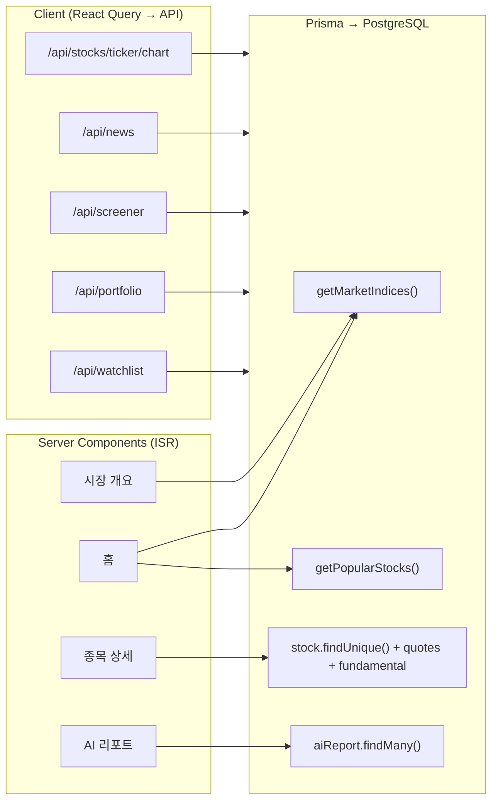
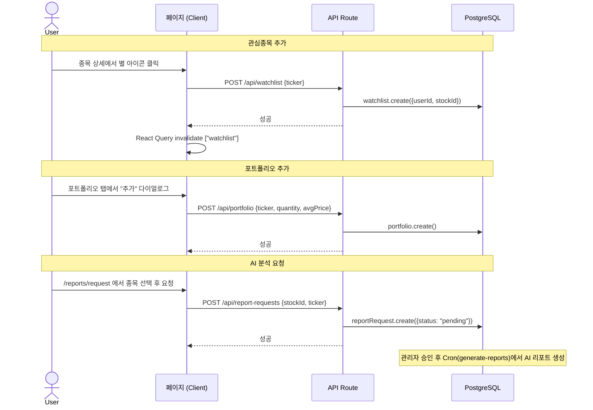

# StockView v1.0 페이지 Flow 문서

> 문서 작성일: 2026-03-28
> 작성자: 문서화 담당 A
> 대상 코드: `src/app/` 전체 (Next.js 16 App Router)

---

## 목차

1. [전체 페이지 목록](#1-전체-페이지-목록)
2. [페이지별 상세 Flow](#2-페이지별-상세-flow)
3. [인증/권한 Flow](#3-인증권한-flow)
4. [API 엔드포인트 전체 목록](#4-api-엔드포인트-전체-목록)
5. [글로벌 네비게이션 구조](#5-글로벌-네비게이션-구조)
6. [데이터 Flow 다이어그램](#6-데이터-flow-다이어그램)

---

## 1. 전체 페이지 목록

### 1.1 공개(Public) 페이지

| URL 경로 | 페이지명 | 렌더링 | ISR/revalidate |
|---|---|---|---|
| `/` | 홈 | Server (async) | 900s (15분) |
| `/market` | 시장 개요 | Server (async) | 900s |
| `/stock/[ticker]` | 종목 상세 | Server (async) + SSG(top 50) | 900s |
| `/etf` | ETF 목록 | Server (async) | 900s |
| `/etf/[ticker]` | ETF 상세 | Server (async) + SSG(top 50) | 900s |
| `/news` | 뉴스 | Server (async) | 300s (5분) |
| `/screener` | 스크리너 | Server (async) | - |
| `/screener/[signal]` | 스크리너 시그널별 | Server (async) + SSG(5종) | 900s |
| `/reports` | AI 리포트 목록 | Server (async) | 900s |
| `/reports/[slug]` | AI 리포트 상세 | Server (async) + SSG(최근50) | 900s |
| `/compare` | 종목 비교 | Client | - |
| `/sectors` | 섹터별 종목 | Server (async) | 3600s (1시간) |
| `/sectors/[name]` | 섹터 상세 | Server (async) + SSG | 3600s |
| `/dividends` | 배당 캘린더 | Server (async) | 3600s |
| `/earnings` | 실적 캘린더 | Server (async) | 3600s |
| `/board` | 요청 게시판 목록 | Server (async) | - |
| `/board/[id]` | 게시글 상세 | Server (async) | - |
| `/guide` | 투자 가이드 | Server (static) | - |
| `/guide/technical-indicators` | 기술적 지표 가이드 | Server (static) | - |
| `/guide/dividend-investing` | 배당 투자 가이드 | Server (static) | - |
| `/guide/etf-basics` | ETF 기초 가이드 | Server (static) | - |
| `/guide/reading-financials` | 재무제표 읽는 법 | Server (static) | - |
| `/guide/market-indices` | 주요 지수 이해하기 | Server (static) | - |
| `/about` | 서비스 소개 | Server (static) | - |
| `/contact` | 문의하기 | Server (static) + Client Form | - |
| `/privacy` | 개인정보처리방침 | Server (static) | - |
| `/terms` | 이용약관 | Server (static) | - |
| `/auth/login` | 로그인 | Server (static) + Client Form | - |
| `/auth/register` | 회원가입 | Server (static) + Client Form | - |
| `/auth/forgot-password` | 비밀번호 찾기 | Server (static) | - |

### 1.2 인증 필요(Protected) 페이지

| URL 경로 | 페이지명 | 렌더링 | 비고 |
|---|---|---|---|
| `/watchlist` | 관심종목 + 포트폴리오 | Client | 미인증 시 `/auth/login` 리다이렉트 |
| `/mypage` | 마이페이지 | Client | 미인증 시 리다이렉트 |
| `/settings` | 설정 | Client | 미인증 시 리다이렉트 |
| `/board/new` | 글 작성 | Server + Client Form | 미인증 시 리다이렉트 |
| `/board/[id]/edit` | 글 수정 | Server + Client Form | 본인/관리자만 |
| `/reports/request` | AI 분석 요청 | Client | 미인증 시 안내 표시 |
| `/reports/stock/[ticker]` | 종목별 리포트 히스토리 | Server (async) | 미인증 시 리다이렉트 |

### 1.3 관리자(Admin) 페이지

| URL 경로 | 페이지명 | 렌더링 | 비고 |
|---|---|---|---|
| `/admin/contacts` | 문의 관리 | Client | ADMIN 권한 필수 |
| `/admin/data-health` | 데이터 품질 모니터링 | Client | ADMIN 권한 필수 |

### 1.4 시스템 파일

| 파일 경로 | 용도 |
|---|---|
| `layout.tsx` | 루트 레이아웃 (AppHeader, Footer, BottomTabBar, CompareFloatingBar, CookieConsent) |
| `error.tsx` | 전역 에러 바운더리 |
| `not-found.tsx` | 404 페이지 |
| `robots.ts` | robots.txt 생성 |
| `sitemap.ts` | 기본 sitemap |
| `sitemap-index.xml/route.ts` | sitemap 인덱스 |
| `sitemap-stocks.xml/route.ts` | 종목 sitemap |
| `sitemap-etf.xml/route.ts` | ETF sitemap |
| `sitemap-reports.xml/route.ts` | 리포트 sitemap |

---

## 2. 페이지별 상세 Flow

### 2.1 홈페이지 (`/`)

- **URL 경로**: `/`
- **페이지 목적**: 서비스 랜딩 페이지. 주요 지수, 환율, 인기 종목, 최신 뉴스를 한눈에 제공
- **주요 컴포넌트**:
  - `HeroSection` -- 서비스 소개 영역
  - `CompactIndexBar` -- 컴팩트 지수+환율 바 (스크롤 가능)
  - `IndexGroups` / `IndexCard` / `IndexSparkline` -- 주요 지수 (KOSPI, KOSDAQ, S&P500, NASDAQ)
  - `PopularStocksTabs` -- 인기 종목 (KR/US 탭)
  - `LatestNewsSection` / `NewsCard` -- 최신 뉴스 4건 (Suspense 스트리밍)
  - `QuickLinkGrid` / `QuickLinkCard` -- 스크리너/AI리포트/종목비교/가이드 바로가기
  - `AdSlot` -- 하단 광고
- **데이터 소스** (Server Component, 병렬 fetch):
  - `getMarketIndices()` -- 시장 지수
  - `getExchangeRates()` -- 환율 (USD, EUR, JPY, CNY, GBP)
  - `getPopularStocks("KR", 10)` / `getPopularStocks("US", 10)` -- 거래대금 상위
  - `getLatestNews(4)` -- 최신 뉴스
  - `auth()` -- 세션 확인 (비로그인 시 가이드/회원가입 배너 표시)
- **사용자 인터랙션**:
  - KR/US 인기 종목 탭 전환
  - 종목 클릭 -> `/stock/[ticker]`
  - 뉴스 클릭 -> 외부 URL
  - 퀵 링크 클릭 -> 각 기능 페이지
  - 비로그인 시 "투자 가이드 보기" / "무료 회원가입" CTA
- **네비게이션 Flow**:
  - FROM: 모든 페이지 (글로벌 네비게이션의 "홈")
  - TO: `/market`, `/stock/[ticker]`, `/news`, `/screener`, `/reports`, `/compare`, `/guide`, `/auth/register`, `/auth/login`

---

### 2.2 시장 개요 (`/market`)

- **URL 경로**: `/market`
- **페이지 목적**: 한국/미국 시장 전체 현황 (지수, 환율, 상승/하락 종목)
- **주요 컴포넌트**:
  - `IndexCard` (variant="expanded") -- 4열 지수 (KOSPI, KOSDAQ, SPX, IXIC)
  - `ExchangeRateBadge` -- 우측 상단 환율 뱃지
  - `MarketFilterChips` -- 한국/미국 상승/하락 종목 필터 칩 + 동적 콘텐츠
- **데이터 소스** (Server, 병렬):
  - `getMarketIndices()` -- 지수
  - `getExchangeRate()` -- USD/KRW 환율
  - `getMarketMovers("KR")` / `getMarketMovers("US")` -- 상승/하락 종목
- **사용자 인터랙션**:
  - 필터 칩으로 KR/US, 상승/하락 전환
  - 종목 클릭 -> `/stock/[ticker]`
- **네비게이션 Flow**:
  - FROM: 홈, 헤더 "투자 정보" 카테고리
  - TO: `/stock/[ticker]`

---

### 2.3 종목 상세 (`/stock/[ticker]`)

- **URL 경로**: `/stock/[ticker]`
- **페이지 목적**: 개별 종목의 시세, 차트, 기본정보, 뉴스, 배당/실적/공시 이벤트를 탭으로 제공
- **주요 컴포넌트**:
  - `StockTabs` -- 탭 컨테이너 (차트, 정보, 뉴스, 이벤트)
  - `ChartTabServer` / `ChartTabClient` -- TradingView lightweight-charts 기반 가격 차트 (기간 선택: 1M/3M/6M/1Y/3Y)
  - `InfoTabServer` -- 기본 정보 (기업 설명, 펀더멘털, 동종업계 비교)
  - `NewsTabServer` -- 종목 관련 뉴스
  - `EventsTabWrapper` -- 이벤트 탭 (배당/실적/공시 서브탭)
    - `DividendTabServer` -- 배당 이력
    - `EarningsTabServer` -- 실적 이력
    - `DisclosureTabServer` -- 공시 (KR 종목만)
  - `Breadcrumb` -- 주식 > 종목명
- **데이터 소스**:
  - `prisma.stock.findUnique()` -- 종목 기본 + 최신 시세 + 펀더멘털
  - `getChartData()` -- 차트 OHLCV (React Query prefetch)
  - `prisma.aiReport.count()` -- 리포트 개수
  - 각 탭별 서버 컴포넌트에서 Prisma 직접 조회
- **사용자 인터랙션**:
  - 탭 전환 (차트/정보/뉴스/이벤트)
  - 차트 기간 변경 (Client)
  - 관심종목 추가/제거 (별 아이콘)
  - 비교 목록에 추가
  - AI 리포트 링크 클릭
- **네비게이션 Flow**:
  - FROM: 홈 인기종목, 시장 상승/하락, 스크리너, 검색, 관심종목, 섹터, 배당/실적 캘린더
  - TO: `/reports/[slug]`, `/reports/stock/[ticker]`, `/reports/request?ticker=X`, `/compare`

---

### 2.4 ETF 목록 (`/etf`)

- **URL 경로**: `/etf`
- **페이지 목적**: 한국/미국 ETF 거래대금 상위 목록
- **주요 컴포넌트**:
  - `Tabs` (KR/US) -- 시장 전환
  - `StockRow` -- ETF 행 (순위, 이름, 가격, 등락률, 거래대금)
- **데이터 소스**: `getPopularETFs("KR", 30)` / `getPopularETFs("US", 30)`
- **사용자 인터랙션**: KR/US 탭 전환, ETF 클릭 -> `/etf/[ticker]`

### 2.5 ETF 상세 (`/etf/[ticker]`)

- **URL 경로**: `/etf/[ticker]`
- **페이지 목적**: 개별 ETF 시세, 차트, 정보, 뉴스, 배당/실적 이벤트 (주식 상세와 동일 구조)
- **주요 컴포넌트**: `StockTabs` 재사용 (공시 탭은 비활성)
- **데이터 소스**: 종목 상세와 동일 (stockType=ETF)

---

### 2.6 뉴스 (`/news`)

- **URL 경로**: `/news`
- **페이지 목적**: 한국/미국 시장 뉴스 피드 (카테고리별 필터링)
- **주요 컴포넌트**:
  - `NewsClient` -- Client Component (카테고리 필터, 무한 스크롤/페이지네이션)
- **데이터 소스**:
  - Server: `getLatestNews(10)` (초기 데이터)
  - Client: `/api/news` (추가 로드)
- **사용자 인터랙션**: 카테고리 필터 (전체/경제/산업/시장/기업), 뉴스 클릭 -> 외부 URL

---

### 2.7 스크리너 (`/screener`)

- **URL 경로**: `/screener`
- **페이지 목적**: 기술적 시그널 기반 종목 스크리닝 (골든크로스, RSI 과매도, 거래량 급증 등)
- **주요 컴포넌트**:
  - `ScreenerClient` -- Client Component (시장 KR/US 전환, 시그널 선택, 결과 테이블)
- **데이터 소스**:
  - Server: `getScreenerData("KR", "golden_cross")` (React Query prefetch)
  - Client: `/api/screener` (시그널/시장 변경 시)
- **사용자 인터랙션**: 시장 전환, 시그널 선택, 종목 클릭 -> `/stock/[ticker]`

### 2.8 스크리너 시그널 상세 (`/screener/[signal]`)

- **URL 경로**: `/screener/golden-cross`, `/screener/rsi-oversold`, `/screener/volume-surge`, `/screener/bollinger-bounce`, `/screener/macd-cross`
- **페이지 목적**: 특정 시그널의 SEO 랜딩 페이지 (KR/US 모두 표시)
- **데이터 소스**: `getScreenerData("KR", signalType)` + `getScreenerData("US", signalType)`

---

### 2.9 AI 리포트 목록 (`/reports`)

- **URL 경로**: `/reports`
- **페이지 목적**: AI 생성 종목 분석 리포트 목록 + 분석 요청 탭
- **주요 컴포넌트**:
  - `ReportsPageTabs` -- 리포트/요청 탭
  - `ReportsClient` -- 리포트 리스트 (시그널/판정 필터, 페이지네이션)
- **데이터 소스**: `prisma.aiReport.findMany()` (최신 20건 + 전체 count)
- **사용자 인터랙션**: 필터링, 페이지 전환, 리포트 클릭 -> `/reports/[slug]`

### 2.10 AI 리포트 상세 (`/reports/[slug]`)

- **URL 경로**: `/reports/[slug]`
- **페이지 목적**: 개별 AI 분석 리포트 (요약, 시세 현황, AI 분석 본문, 기술적 지표, 밸류에이션, 관련 뉴스)
- **주요 컴포넌트**:
  - 헤더 (날짜, 시그널 뱃지, 판정 뱃지)
  - `MetricCard` -- 시세 현황 4칸
  - `TechnicalCard` -- RSI, MACD, 볼린저밴드
  - 밸류에이션 테이블
  - 관련 뉴스 리스트
  - 동일 종목 다른 리포트 링크 (비로그인 2건, 로그인 5건)
  - 면책조항 (인공지능기본법 제31조)
- **데이터 소스**: `prisma.aiReport.findUnique()` + `prisma.aiReport.findMany()` (동일 종목)
- **사용자 인터랙션**: 다른 리포트 클릭, "종목 상세 보기" -> `/stock/[ticker]`, 목록으로 돌아가기
- **비로그인 제한**: 동일 종목 다른 리포트 2건까지만 표시 + 로그인 유도

### 2.11 AI 분석 요청 (`/reports/request`)

- **URL 경로**: `/reports/request`
- **페이지 목적**: 사용자가 특정 종목의 AI 분석을 요청
- **주요 컴포넌트**: `StockSearchInput`, 요청 폼
- **데이터 소스**: `/api/report-requests` (POST)
- **인증**: 필수 (미인증 시 로그인 안내 표시)
- **제약**: 하루 3건, 중복 요청 불가

### 2.12 종목별 리포트 히스토리 (`/reports/stock/[ticker]`)

- **URL 경로**: `/reports/stock/[ticker]`
- **페이지 목적**: 특정 종목의 AI 리포트 전체 히스토리 + 판정 변화 타임라인
- **인증**: 필수 (미들웨어에서 리다이렉트)
- **데이터 소스**: `prisma.stock.findUnique()` + `prisma.aiReport.findMany()`

---

### 2.13 종목 비교 (`/compare`)

- **URL 경로**: `/compare`
- **페이지 목적**: 최대 4종목의 주요 지표 비교 (PER, PBR, 배당률, ROE 등) + 가격 차트 오버레이
- **주요 컴포넌트**:
  - `StockSearchInput` x N (2~4 슬롯)
  - 비교 테이블 (COMPARE_ROWS: 현재가, 등락률, 시가총액, PER, PBR, 배당률, ROE, EPS)
  - `CompareChart` (동적 import) -- 가격 차트 오버레이
  - `CompareFundamentals` (동적 import) -- 펀더멘털 비교
- **데이터 소스**: Client fetch `/api/stocks/[ticker]` (각 종목별)
- **사용자 인터랙션**: 종목 검색/선택, 슬롯 추가/삭제, 종목명 클릭 -> `/stock/[ticker]`
- **CompareContext**: 관심종목/종목상세에서 "비교에 추가" 후 플로팅 바 -> 비교 페이지 이동

---

### 2.14 섹터별 종목 (`/sectors`, `/sectors/[name]`)

- **URL 경로**: `/sectors`, `/sectors/[name]`
- **페이지 목적**: 한국 주식 섹터별 분류 및 종목 리스트
- **주요 컴포넌트**:
  - `SectorList` -- 섹터 카드 그리드
  - 섹터 상세: 종목 테이블 (시가총액 순, 현재가, 등락률, PER 포함)
- **데이터 소스**: `getSectorList()`, `getSectorStocks()`, `getSectorSummary()`

---

### 2.15 배당 캘린더 (`/dividends`)

- **URL 경로**: `/dividends`
- **페이지 목적**: 한국/미국 배당 일정 (예정/최근) + 고배당 종목 TOP 10
- **주요 컴포넌트**: `DividendTable`, `HighDividendSection`
- **데이터 소스**: `getUpcomingDividends()`, `getRecentDividends()`, `getHighDividendStocks()`

### 2.16 실적 캘린더 (`/earnings`)

- **URL 경로**: `/earnings`
- **페이지 목적**: 한국/미국 실적 발표 일정 (예정/최근 결과 - Beat/Miss/Meet)
- **주요 컴포넌트**: `EarningsTable`, `BeatBadge`
- **데이터 소스**: `getUpcomingEarnings()`, `getRecentEarningsResults()`

---

### 2.17 요청 게시판 (`/board`, `/board/[id]`, `/board/new`, `/board/[id]/edit`)

- **`/board`**: 게시글 목록 (비밀글 필터링 - 관리자 전체, 본인 비밀글, 비로그인은 공개만)
  - 컴포넌트: `BoardListClient`
  - 데이터: `prisma.boardPost.findMany()`
- **`/board/[id]`**: 게시글 상세 + 댓글
  - 컴포넌트: `PostDetailClient`
  - 데이터: `prisma.boardPost.findUnique()` + `prisma.boardComment.findMany()`
  - 권한: `canViewPost()` -- 비밀글은 작성자/관리자만
- **`/board/new`**: 글 작성 (인증 필수)
  - 컴포넌트: `NewFormClient`
- **`/board/[id]/edit`**: 글 수정 (인증 필수 + 본인/관리자)
  - 컴포넌트: `EditFormClient`
  - 권한: `canEditPost()`

---

### 2.18 관심종목 + 포트폴리오 (`/watchlist`)

- **URL 경로**: `/watchlist`
- **페이지 목적**: 관심종목 리스트 + 포트폴리오 수익률 관리 (탭 구조)
- **주요 컴포넌트**:
  - `Tabs` (관심종목 / 포트폴리오)
  - 관심종목: `StockRow`, 비교 추가/삭제, 관심종목 삭제
  - 포트폴리오: `PortfolioSummary`, `PortfolioRow`, `AddPortfolioDialog`, `MarketGroupHeader` (KR/US 그룹)
- **데이터 소스** (Client, React Query):
  - `/api/watchlist` (GET)
  - `/api/portfolio` (GET)
- **사용자 인터랙션**: 종목 클릭, 비교 추가, 삭제, 포트폴리오 종목 추가 다이얼로그

### 2.19 마이페이지 (`/mypage`)

- **URL 경로**: `/mypage`
- **페이지 목적**: 사용자 프로필 + 관심종목 미리보기 + 빠른 링크
- **주요 컴포넌트**: 프로필 카드 (아바타, 이름, 이메일), 관심종목 5건 미리보기, 퀵 링크 (관심종목 관리, 설정, 로그아웃)
- **데이터 소스**: `useSession()`, `/api/watchlist` (Client)

### 2.20 설정 (`/settings`)

- **URL 경로**: `/settings`
- **페이지 목적**: 프로필 수정 (닉네임), 비밀번호 변경, 테마 설정
- **주요 컴포넌트**: 프로필 카드 (react-hook-form + Zod), 비밀번호 카드, 테마 카드 (라이트/다크/시스템)
- **데이터 소스**: `/api/settings/profile` (PATCH), `/api/settings/password` (PATCH)

---

### 2.21 투자 가이드 (`/guide/*`)

| URL | 제목 |
|---|---|
| `/guide` | 가이드 목록 (5개 카드 그리드) |
| `/guide/technical-indicators` | 기술적 지표 완전 가이드 |
| `/guide/dividend-investing` | 배당 투자 시작하기 |
| `/guide/etf-basics` | ETF 투자 기초 |
| `/guide/reading-financials` | 재무제표 읽는 법 |
| `/guide/market-indices` | 주요 지수 이해하기 |

- 모든 가이드는 정적 콘텐츠 (Server static)
- 각 가이드에서 관련 기능 페이지로 링크 (스크리너, 배당, ETF, 시장 등)

---

### 2.22 정적/유틸리티 페이지

| URL | 목적 |
|---|---|
| `/about` | 서비스 소개, 데이터 출처, AI 리포트 편집 방침, 면책 고지 |
| `/contact` | 문의 양식 (이름/이메일/카테고리/내용) + FAQ |
| `/privacy` | 개인정보처리방침 (2026.03.22 시행) |
| `/terms` | 이용약관 (투자 면책, AI 생성 콘텐츠 고지, 인공지능기본법 제31조) |

---

### 2.23 관리자 페이지

- **`/admin/contacts`**: 문의 관리 (페이지네이션, 카테고리 라벨, 확장/축소)
  - API: `/api/admin/contacts` (GET, 관리자 전용)
- **`/admin/data-health`**: 데이터 품질 모니터링
  - 활성 종목 수, 24h 뉴스 수, 지표 커버리지, 시세 갱신 현황
  - 최근 Cron 실행 로그 (작업명, 상태, 소요시간, 시각)
  - API: `/api/admin/data-health` (GET, 관리자 전용)

---

## 3. 인증/권한 Flow

### 3.1 인증 구조

```
NextAuth 5 (beta)
├── Provider: Credentials (이메일 + 비밀번호)
├── Provider: Google OAuth
├── Adapter: PrismaAdapter
├── Session: JWT (maxAge: 30일)
└── Custom Pages: signIn -> /auth/login
```

### 3.2 로그인 Flow



### 3.3 회원가입 Flow



### 3.4 미들웨어 권한 체크 (`src/proxy.ts`)

```mermaid
flowchart TD
    A[Request] --> B{Admin 경로?}
    B -->|Yes| C{인증 + ADMIN 역할?}
    C -->|No + API| D[403 JSON]
    C -->|No + Page| E[/ 리다이렉트]
    C -->|Yes| F[NextResponse.next()]
    B -->|No| G{Protected 경로?}
    G -->|Yes| H{인증됨?}
    H -->|No + API| I[401 JSON]
    H -->|No + Page| J[/auth/login?callbackUrl 리다이렉트]
    H -->|Yes| F
    G -->|No| F
```

**Protected 경로 목록**:
- `/watchlist/*`, `/settings/*`, `/mypage/*`
- `/api/watchlist/*`, `/api/portfolio/*`
- `/reports/stock/*`
- `/board/new`, `/board/[id]/edit`

**Admin 경로 목록**:
- `/admin/*`, `/api/admin/*`

---

## 4. API 엔드포인트 전체 목록

### 4.1 인증 API

| 엔드포인트 | Method | 인증 | 설명 |
|---|---|---|---|
| `/api/auth/[...nextauth]` | GET, POST | - | NextAuth 핸들러 (로그인/로그아웃/세션/콜백) |
| `/api/auth/register` | POST | - | 회원가입 (이메일, 비밀번호, 닉네임) |

### 4.2 종목 API

| 엔드포인트 | Method | 인증 | 설명 |
|---|---|---|---|
| `/api/stocks/search` | GET | - | 종목 검색 (q 파라미터) |
| `/api/stocks/popular` | GET | - | 인기 종목 (market, limit) |
| `/api/stocks/[ticker]` | GET | - | 종목 상세 정보 |
| `/api/stocks/[ticker]/chart` | GET | - | OHLCV 차트 데이터 (period) |
| `/api/stocks/[ticker]/news` | GET | - | 종목 관련 뉴스 |
| `/api/stocks/[ticker]/dividends` | GET | - | 배당 이력 |
| `/api/stocks/[ticker]/earnings` | GET | - | 실적 이력 |
| `/api/stocks/[ticker]/disclosures` | GET | - | 공시 (KR only) |
| `/api/stocks/[ticker]/peers` | GET | - | 동종업계 종목 |
| `/api/stocks/[ticker]/institutional` | GET | - | 기관 매매 동향 |
| `/api/stocks/[ticker]/fundamental-history` | GET | - | 펀더멘털 히스토리 |

### 4.3 시장 API

| 엔드포인트 | Method | 인증 | 설명 |
|---|---|---|---|
| `/api/market/indices` | GET | - | 시장 지수 (KOSPI, KOSDAQ, SPX, IXIC) |
| `/api/market/exchange-rate` | GET | - | USD/KRW 환율 |
| `/api/market/kr/movers` | GET | - | 한국 상승/하락 종목 |
| `/api/market/us/movers` | GET | - | 미국 상승/하락 종목 |
| `/api/market/sectors` | GET | - | 섹터 목록 |
| `/api/market/sectors/[name]/stocks` | GET | - | 섹터별 종목 |
| `/api/market-indices/history` | GET | - | 지수 히스토리 (스파크라인) |

### 4.4 ETF API

| 엔드포인트 | Method | 인증 | 설명 |
|---|---|---|---|
| `/api/etf/popular` | GET | - | 인기 ETF (market, limit) |

### 4.5 뉴스 API

| 엔드포인트 | Method | 인증 | 설명 |
|---|---|---|---|
| `/api/news` | GET | - | 뉴스 목록 (카테고리, 페이지) |
| `/api/news/latest` | GET | - | 최신 뉴스 (limit) |

### 4.6 스크리너 API

| 엔드포인트 | Method | 인증 | 설명 |
|---|---|---|---|
| `/api/screener` | GET | - | 기술적 스크리너 (market, signal) |
| `/api/screener/fundamental` | GET | - | 펀더멘털 스크리너 |

### 4.7 AI 리포트 API

| 엔드포인트 | Method | 인증 | 설명 |
|---|---|---|---|
| `/api/reports` | GET | - | 리포트 목록 (필터, 페이지네이션) |
| `/api/reports/[slug]` | GET | - | 리포트 상세 |
| `/api/report-requests` | GET | 선택 | 분석 요청 목록 |
| `/api/report-requests` | POST | 필수 | 분석 요청 생성 (하루 3건, 중복 불가) |
| `/api/report-requests/[id]` | PATCH | 관리자 | 요청 상태 변경 (승인/반려) |
| `/api/report-requests/[id]` | DELETE | 관리자 | 요청 삭제 |
| `/api/report-requests/[id]/comments` | GET | - | 요청 댓글 목록 |
| `/api/report-requests/[id]/comments` | POST | 필수 | 요청 댓글 작성 |

### 4.8 섹터 API

| 엔드포인트 | Method | 인증 | 설명 |
|---|---|---|---|
| `/api/sectors` | GET | - | 섹터 목록 (market) |

### 4.9 관심종목/포트폴리오 API (인증 필수)

| 엔드포인트 | Method | 인증 | 설명 |
|---|---|---|---|
| `/api/watchlist` | GET | 필수 | 관심종목 목록 (최신 시세 포함) |
| `/api/watchlist` | POST | 필수 | 관심종목 추가 (ticker) |
| `/api/watchlist/[ticker]` | DELETE | 필수 | 관심종목 삭제 |
| `/api/portfolio` | GET | 필수 | 포트폴리오 목록 + 수익률 요약 |
| `/api/portfolio` | POST | 필수 | 포트폴리오 종목 추가 (ticker, quantity, avgPrice) |
| `/api/portfolio/[id]` | PATCH | 필수 | 포트폴리오 항목 수정 |
| `/api/portfolio/[id]` | DELETE | 필수 | 포트폴리오 항목 삭제 |

### 4.10 게시판 API

| 엔드포인트 | Method | 인증 | 설명 |
|---|---|---|---|
| `/api/board` | GET | 선택 | 게시글 목록 (비밀글 필터링) |
| `/api/board` | POST | 필수 | 글 작성 (title, content, isPrivate) |
| `/api/board/[id]` | GET | 선택 | 게시글 상세 (조회수 증가) |
| `/api/board/[id]` | PATCH | 필수 | 글 수정 (본인/관리자) |
| `/api/board/[id]` | DELETE | 필수 | 글 삭제 (본인/관리자) |
| `/api/board/[id]/comments` | GET | 선택 | 댓글 목록 |
| `/api/board/[id]/comments` | POST | 필수 | 댓글 작성 |
| `/api/board/comments/[commentId]` | PATCH | 필수 | 댓글 수정 (본인/관리자) |
| `/api/board/comments/[commentId]` | DELETE | 필수 | 댓글 삭제 (본인/관리자) |

### 4.11 설정 API (인증 필수)

| 엔드포인트 | Method | 인증 | 설명 |
|---|---|---|---|
| `/api/settings/profile` | PATCH | 필수 | 닉네임 변경 |
| `/api/settings/password` | PATCH | 필수 | 비밀번호 변경 (현재 비밀번호 확인) |

### 4.12 문의 API

| 엔드포인트 | Method | 인증 | 설명 |
|---|---|---|---|
| `/api/contact` | POST | - | 문의 등록 (이름, 이메일, 카테고리, 내용) |

### 4.13 관리자 API (ADMIN 권한 필수)

| 엔드포인트 | Method | 인증 | 설명 |
|---|---|---|---|
| `/api/admin/contacts` | GET | ADMIN | 문의 목록 (페이지네이션) |
| `/api/admin/data-health` | GET | ADMIN | 데이터 품질 현황 |

### 4.14 Cron API (CRON_SECRET Bearer 토큰 필수)

| 엔드포인트 | Method | 주기 | 설명 |
|---|---|---|---|
| `/api/cron/collect-master` | POST | 주 1회 | KR/US 마스터 데이터 동기화 |
| `/api/cron/collect-kr-quotes` | POST | 평일 | 한국 시세 수집 (Naver) |
| `/api/cron/collect-us-quotes` | POST | 평일 | 미국 시세 수집 (Yahoo) |
| `/api/cron/collect-exchange-rate` | POST | 매일 | 환율 수집 |
| `/api/cron/collect-news` | POST | 매일 | 뉴스 수집 (RSS) |
| `/api/cron/collect-fundamentals` | POST | 주기적 | 펀더멘털 데이터 수집 |
| `/api/cron/collect-institutional` | POST | 주기적 | 기관 매매 동향 수집 |
| `/api/cron/collect-events` | POST | 주기적 | 배당/실적 이벤트 수집 |
| `/api/cron/collect-dart-dividends` | POST | 주기적 | DART 배당 정보 수집 |
| `/api/cron/collect-disclosures` | POST | 주기적 | 공시 수집 |
| `/api/cron/analyze-sentiment` | POST | 주기적 | 뉴스 감성 분석 |
| `/api/cron/generate-reports` | POST | 매일 | AI 리포트 자동 생성 |
| `/api/cron/sync-corp-codes` | POST | 주기적 | DART 기업 코드 동기화 |
| `/api/cron/sync-kr-sectors` | POST | 주기적 | 한국 섹터 분류 동기화 |
| `/api/cron/cleanup` | POST | 매일 | 오래된 데이터 정리 (21일+), 비활성 종목 처리 (90일+) |

---

## 5. 글로벌 네비게이션 구조

### 5.1 루트 레이아웃 구조

```
<html>
  <body>
    <Providers>         ← SessionProvider, ThemeProvider, QueryClientProvider, CompareProvider, Toaster
      <AppHeader />     ← 상단 고정 헤더
      <div pb-14>       ← 하단 탭바 높이만큼 padding
        {children}      ← 페이지 콘텐츠
      </div>
      <Footer />        ← 푸터
      <BottomTabBar />  ← 모바일 하단 탭바 (lg: 숨김)
      <CompareFloatingBar /> ← 비교 종목 플로팅 바
      <CookieConsent /> ← 쿠키 동의 배너
    </Providers>
    <Analytics />       ← Vercel Analytics
    <SpeedInsights />   ← Vercel Speed Insights
  </body>
</html>
```

### 5.2 데스크톱 헤더 (AppHeader)

```
┌──────────────────────────────────────────────────────────┐
│ [Logo] StockView  [홈] [투자 정보] [분석] [뉴스] [더보기]  │
│                         [검색바]  [테마] [아바타/로그인]    │
├──────────────────────────────────────────────────────────┤
│ 서브 네비: [시장] [ETF] [섹터] [배당] [실적]    (카테고리별)│
└──────────────────────────────────────────────────────────┘
```

**1단 메인 네비게이션 카테고리**:

| 카테고리 | 대표 경로 | 매칭 prefix |
|---|---|---|
| 홈 | `/` | `/` (exact) |
| 투자 정보 | `/market` | `/market`, `/etf`, `/sectors`, `/dividends`, `/earnings` |
| 분석 | `/screener` | `/screener`, `/reports`, `/compare`, `/guide` |
| 뉴스 | `/news` | `/news`, `/board` |
| 더보기 | `/watchlist` | `/watchlist`, `/portfolio`, `/mypage`, `/settings`, `/about`, `/contact` |

**2단 서브 네비게이션** (활성 카테고리에 따라 표시):

| 투자 정보 | 분석 | 뉴스 | 더보기 |
|---|---|---|---|
| 시장, ETF, 섹터, 배당, 실적 | 스크리너, AI 리포트, 분석 요청, 비교, 가이드 | 뉴스, 게시판 | 관심종목, 포트폴리오, 마이페이지, 소개 |

### 5.3 모바일 네비게이션

**모바일 하단 탭바** (BottomTabBar, `lg:hidden`):

| 아이콘 | 라벨 | 경로 | 비고 |
|---|---|---|---|
| Home | 홈 | `/` | |
| Search | 검색 | 오버레이 | SearchCommand 모달 |
| Globe | 시장 | `/market` | |
| Star | 관심 | `/watchlist` | |
| User | MY | `/mypage` | |

**모바일 햄버거 메뉴** (Sheet, 우측 슬라이드):
- 검색바
- 그룹별 네비게이션: 투자 정보 / 분석 도구 / 뉴스+커뮤니티 / MY
- 비로그인 시 로그인/회원가입 버튼

### 5.4 사용자 드롭다운 (로그인 상태)

- 아바타 클릭 -> DropdownMenu
  - 사용자 이름/이메일
  - 마이페이지 (`/mypage`)
  - 관심종목 (`/watchlist`)
  - 로그아웃

### 5.5 푸터 (Footer)

링크: 개인정보처리방침 | 이용약관 | 쿠키 설정 | 서비스 소개 | 게시판 | 문의하기
+ 투자 면책 고지 + 저작권 표시

### 5.6 비교 플로팅 바 (CompareFloatingBar)

- CompareContext에 종목이 1개 이상 있을 때 하단에 표시
- 선택된 종목 뱃지 + "비교하기" 버튼 -> `/compare` 이동

---

## 6. 데이터 Flow 다이어그램

### 6.1 전체 데이터 파이프라인



### 6.2 페이지별 데이터 조회 경로



### 6.3 사용자 인터랙션 데이터 Flow



### 6.4 Cron Job 실행 Flow

```mermaid
flowchart LR
    GHA["GitHub Actions<br/>(UTC 스케줄)"] -->|HTTP GET + Bearer Token| Cron["/api/cron/*"]
    Cron -->|CRON_SECRET 검증| Logic["비즈니스 로직"]
    Logic -->|외부 API 호출<br/>withRetry(3회)| External["외부 데이터 소스"]
    External -->|데이터| Logic
    Logic -->|Upsert (멱등성)| DB["PostgreSQL"]
    Logic -->|결과 기록| CronLog["CronLog 테이블"]
```

---

## 부록: 주요 기술적 결정사항

| 항목 | 선택 | 비고 |
|---|---|---|
| 주가 색상 | 빨강=상승, 파랑=하락 | 한국 관례 (`--color-stock-up: #e53e3e`, `--color-stock-down: #3182ce`) |
| ISR 주기 | 시세 관련 15분, 정보 관련 1시간 | Vercel ISR (revalidate) |
| 차트 라이브러리 | lightweight-charts (TradingView) | SSR 미지원 → dynamic import |
| 검색 | `SearchBar` (데스크톱) + `SearchCommand` (모바일 오버레이) | `/api/stocks/search` 호출 |
| 상태 관리 | React Query (서버 상태) + Context (비교 종목) + next-themes (테마) | |
| 폼 검증 | react-hook-form + Zod | 모든 API 입력도 Zod 검증 |
| 광고 | Google AdSense + GTM | 쿠키 동의 연동 (GDPR) |
| SEO | JSON-LD (Organization, WebSite, WebPage, FinancialProduct, Article) + Breadcrumb | |
| Analytics | Google Tag Manager + Vercel Analytics + Speed Insights | |
