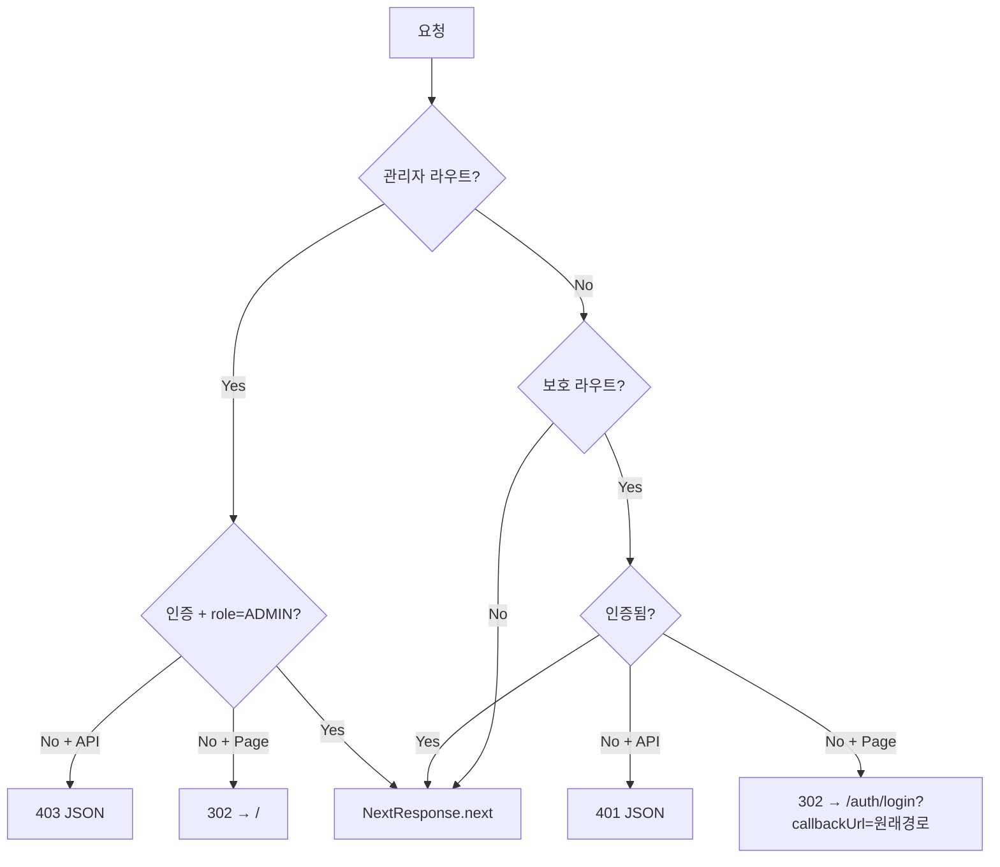

# StockView v1.0 페이지 Flow 문서 (사용자 여정 관점)

> 작성일: 2026-03-28
> 작성 기준: `src/app/` 전체 파일 기반 (100% 코드 기반 분석)
> 목적: UX / FE / BE 팀을 위한 v1.0 공식 기획 문서

---

## 목차

1. [글로벌 레이아웃 구조](#1-글로벌-레이아웃-구조)
2. [사용자 진입점](#2-사용자-진입점)
3. [사용자 여정별 Flow](#3-사용자-여정별-flow)
4. [페이지 전체 인벤토리](#4-페이지-전체-인벤토리)
5. [API 전체 인벤토리](#5-api-전체-인벤토리)
6. [컴포넌트 의존성 맵](#6-컴포넌트-의존성-맵)
7. [상태 관리 & 데이터 Fetching 패턴](#7-상태-관리--데이터-fetching-패턴)
8. [미들웨어 & 라우트 보호](#8-미들웨어--라우트-보호)
9. [전체 사이트맵 다이어그램](#9-전체-사이트맵-다이어그램)

---

## 1. 글로벌 레이아웃 구조

### Root Layout (`src/app/layout.tsx`)

모든 페이지에 공통 적용되는 최상위 레이아웃.

```
<html lang="ko">
  <head>
    - GTM consent script
    - Google Tag Manager
    - AdSense (조건부)
  </head>
  <body>
    <GoogleTagManagerNoscript />
    <JsonLd: Organization, WebSite />
    <Providers>
      ├── SessionProvider (NextAuth)
      ├── QueryClientProvider (TanStack Query)
      ├── ThemeProvider (next-themes: light/dark/system)
      ├── TooltipProvider
      └── CompareProvider (종목 비교 컨텍스트)

      <AppHeader />           ← 상단 네비게이션 (sticky)
      <div pb-14 lg:pb-0>
        {children}             ← 페이지 콘텐츠
      </div>
      <Footer />              ← 하단 링크 (개인정보, 약관, 소개 등)
      <BottomTabBar />        ← 모바일 하단 탭 (lg:hidden)
      <CompareFloatingBar />  ← 비교 종목 플로팅 바
      <CookieConsent />       ← 쿠키 동의 배너
    </Providers>
    <Analytics />             ← Vercel Analytics
    <SpeedInsights />         ← Vercel Speed Insights
  </body>
</html>
```

### 네비게이션 구조

#### PC (Desktop, lg 이상)

| 위치 | 구성 |
|------|------|
| **1단 헤더** | 로고 / 홈 / 투자 정보 / 분석 / 뉴스 / 더보기 / 검색바 / 테마 토글 / 로그인-회원가입 또는 아바타 드롭다운 |
| **2단 서브 네비** | 활성 카테고리의 하위 링크 (e.g. "투자 정보" 선택 시 → 시장, ETF, 섹터, 배당, 실적) |

카테고리 매핑:

| 카테고리 | 하위 링크 | URL prefix |
|----------|-----------|-----------|
| 투자 정보 | 시장, ETF, 섹터, 배당, 실적 | `/market`, `/etf`, `/sectors`, `/dividends`, `/earnings` |
| 분석 | 스크리너, AI 리포트, 분석 요청, 비교, 가이드 | `/screener`, `/reports`, `/compare`, `/guide` |
| 뉴스 | 뉴스, 게시판 | `/news`, `/board` |
| 더보기 | 관심종목, 포트폴리오, 마이페이지, 소개 | `/watchlist`, `/portfolio`, `/mypage`, `/settings`, `/about`, `/contact` |

#### Mobile (lg 미만)

| 위치 | 구성 |
|------|------|
| **상단 헤더** | 로고 / 검색 아이콘 / 테마 토글 / 아바타 or 햄버거 메뉴 |
| **하단 탭** (fixed bottom) | 홈 / 검색(오버레이) / 시장 / 관심 / MY |
| **사이드 시트** (햄버거) | 검색 + 전체 네비게이션 그룹 4개 + 로그인/가입 버튼 |

#### Footer 링크
개인정보처리방침 / 이용약관 / 쿠키 설정 / 서비스 소개 / 게시판 / 문의하기

---

## 2. 사용자 진입점

### 2.1 Landing Page (홈)
- URL: `/`
- 비로그인 사용자도 접근 가능
- Server Component (ISR 15분)
- 주요 데이터: 시장 지수, 환율, 인기 종목, 최신 뉴스

### 2.2 Direct URL 접근 패턴

| 패턴 | 예시 | 비고 |
|------|------|------|
| 종목 상세 | `/stock/005930`, `/stock/AAPL` | `[ticker]` 동적 |
| ETF 상세 | `/etf/069500`, `/etf/SPY` | `[ticker]` 동적 |
| AI 리포트 상세 | `/reports/samsung-golden-cross-2026-03-28` | `[slug]` 동적 |
| 섹터 상세 | `/sectors/반도체` | `[name]` URL encoded |
| 스크리너 시그널 | `/screener/golden-cross` | `[signal]` 정적 생성 |
| 게시판 글 | `/board/cuid123` | `[id]` 동적 |
| 종목 리포트 히스토리 | `/reports/stock/005930` | `[ticker]` 동적, 로그인 필요 |

### 2.3 OAuth Callback
- URL: `/api/auth/callback/google`
- NextAuth가 자동 처리 (`/api/auth/[...nextauth]/route.ts`)
- 성공 후: callbackUrl 또는 `/` 로 리다이렉트

### 2.4 Deep Linking
- 종목 검색 결과에서 직접 링크: `/stock/{ticker}`
- AI 리포트 요청 시 ticker 파라미터: `/reports/request?ticker=005930`
- 로그인 후 원래 페이지로: `/auth/login?callbackUrl=/watchlist`

---

## 3. 사용자 여정별 Flow

### 3.1 비로그인 사용자 Flow

```mermaid
graph TD
    A[홈 /] --> B[시장 개요 /market]
    A --> C[종목 상세 /stock/ticker]
    A --> D[뉴스 /news]
    A --> E[스크리너 /screener]
    A --> F[ETF /etf]
    A --> G[투자 가이드 /guide]
    A --> H[AI 리포트 /reports]

    C --> C1[차트 탭]
    C --> C2[종목 정보 탭]
    C --> C3[뉴스 탭]
    C --> C4[이벤트 탭: 배당/실적/공시]

    H --> H1[리포트 상세 /reports/slug]
    H1 -->|비로그인 시 2건만| H2[다른 리포트]
    H1 -->|로그인 유도| LOGIN[/auth/login]

    A --> I[검색 → 종목 상세]
    A --> J[게시판 /board]
    J --> J1[게시글 상세 /board/id]

    A --> K[배당 캘린더 /dividends]
    A --> L[실적 캘린더 /earnings]
    A --> M[섹터별 종목 /sectors]
    M --> M1[섹터 상세 /sectors/name]
    A --> N[종목 비교 /compare]

    %% 접근 불가 (리다이렉트)
    PROTECT[/watchlist, /settings, /mypage 등] -->|미들웨어| LOGIN
```

**비로그인으로 접근 가능한 모든 페이지:**

| 카테고리 | 페이지 | 제한 사항 |
|----------|--------|-----------|
| 홈 | `/` | 비로그인 시 초보자 가이드 배너 노출 |
| 시장 | `/market` | 없음 |
| 종목 상세 | `/stock/[ticker]` | 없음 |
| ETF | `/etf`, `/etf/[ticker]` | 없음 |
| 뉴스 | `/news` | 없음 |
| 스크리너 | `/screener`, `/screener/[signal]` | 없음 |
| AI 리포트 | `/reports`, `/reports/[slug]` | 다른 리포트 목록 2건 제한 |
| 배당 | `/dividends` | 없음 |
| 실적 | `/earnings` | 없음 |
| 섹터 | `/sectors`, `/sectors/[name]` | 없음 |
| 비교 | `/compare` | 없음 |
| 게시판 | `/board`, `/board/[id]` | 비공개 글 열람 불가, 글 작성 불가 |
| 가이드 | `/guide`, `/guide/*` (5개 하위) | 없음 |
| 정보 | `/about`, `/contact`, `/privacy`, `/terms` | 없음 |

### 3.2 회원가입/로그인 Flow

```mermaid
graph TD
    START[비로그인 상태] --> A{진입 경로}

    A -->|직접 접근| REG[/auth/register]
    A -->|직접 접근| LOGIN[/auth/login]
    A -->|보호 라우트 접근| MW[미들웨어 리다이렉트]
    MW -->|callbackUrl 포함| LOGIN
    A -->|홈 배너 클릭| REG

    REG --> REG1[RegisterForm 컴포넌트]
    REG1 -->|POST /api/auth/register| REG2{성공?}
    REG2 -->|Yes| LOGIN
    REG2 -->|No: 중복 이메일 등| REG1

    LOGIN --> LOGIN1[LoginForm 컴포넌트]
    LOGIN1 -->|Credentials| LOGIN2[NextAuth signIn]
    LOGIN1 -->|Google OAuth| GOOGLE[Google 로그인]

    GOOGLE --> GCALLBACK[/api/auth/callback/google]
    GCALLBACK -->|신규: 계정+닉네임 자동 생성| SESSION
    GCALLBACK -->|기존: 로그인| SESSION

    LOGIN2 --> SESSION[JWT 세션 생성 30일]
    SESSION -->|callbackUrl 있으면| CALLBACK[원래 페이지]
    SESSION -->|없으면| HOME[/]

    LOGIN --> FP[/auth/forgot-password]
    FP -->|게시판 문의 안내| BOARD[/board]
    FP --> LOGIN
```

**인증 상세:**
- **Credentials**: 이메일 + 비밀번호 (bcryptjs salt:12, Zod 검증)
- **Google OAuth**: `allowDangerousEmailAccountLinking: true` — 같은 이메일이면 기존 계정에 연결
- **세션**: JWT 전략, 30일 유효, `token.id` + `token.role` 포함
- **커스텀 로그인 페이지**: `/auth/login`
- **비밀번호 찾기**: 이메일 재설정 미구현 → 게시판 문의로 안내

### 3.3 종목 탐색 Flow

```mermaid
graph TD
    ENTRY{진입 경로} --> HOME[홈: 인기 종목 클릭]
    ENTRY --> SEARCH[검색바/검색 오버레이]
    ENTRY --> MARKET[시장 개요: 상승/하락 종목 클릭]
    ENTRY --> SECTOR[섹터 → 섹터 상세 → 종목 클릭]
    ENTRY --> SCREENER[스크리너 결과 → 종목 클릭]
    ENTRY --> ETF_LIST[ETF 목록 → ETF 클릭]
    ENTRY --> DIV[배당 캘린더 → 종목 클릭]
    ENTRY --> EARN[실적 캘린더 → 종목 클릭]
    ENTRY --> REPORT[AI 리포트 → 종목 링크]
    ENTRY --> DIRECT[URL 직접 입력]

    HOME --> STOCK[/stock/ticker]
    SEARCH --> STOCK
    MARKET --> STOCK
    SECTOR --> STOCK
    SCREENER --> STOCK
    DIV --> STOCK
    EARN --> STOCK
    REPORT --> STOCK
    DIRECT --> STOCK
    ETF_LIST --> ETF_DETAIL[/etf/ticker]

    STOCK --> TAB1[차트 탭: ChartTabServer]
    STOCK --> TAB2[종목 정보 탭: InfoTabServer]
    STOCK --> TAB3[뉴스 탭: NewsTabServer]
    STOCK --> TAB4[이벤트 탭: 배당/실적/공시]

    TAB1 -->|기간 변경: 1W~5Y| CHART_API[/api/stocks/ticker/chart?period=X]
    TAB3 --> NEWS_API[/api/stocks/ticker/news]
    TAB4 --> DIV_API[/api/stocks/ticker/dividends]
    TAB4 --> EARN_API[/api/stocks/ticker/earnings]
    TAB4 -->|KR만| DISC_API[/api/stocks/ticker/disclosures]

    STOCK -->|관심종목 추가| WL_ADD[POST /api/watchlist]
    STOCK -->|비교에 추가| COMPARE[CompareContext → /compare]
    STOCK -->|AI 리포트 보기| REPORT_LINK[/reports/stock/ticker]
```

**종목 상세 페이지 구조 (`/stock/[ticker]`):**
- Server Component + ISR 15분
- `generateStaticParams`: 최근 업데이트 50개 종목 프리빌드
- React Query `prefetchQuery`로 차트 데이터 서버 프리페치
- StockTabs 컴포넌트: 차트/정보/뉴스/이벤트 탭 (클라이언트 탭 전환)
- 각 탭은 Suspense로 감싸져 독립 로딩
- 이벤트 탭은 시장에 따라 분기: KR → 배당+실적+공시, US → 배당+실적
- SEO: Breadcrumb, FinancialProduct JsonLd, 동적 메타데이터 (종목명+가격)

**ETF 상세 페이지 (`/etf/[ticker]`):**
- Stock 상세와 동일한 StockTabs 컴포넌트 재사용
- 공시 탭 없음 (`disclosureSlot={null}`)
- Breadcrumb 경로: ETF > [종목명]

### 3.4 관심종목 & 포트폴리오 Flow

```mermaid
graph TD
    STOCK[종목 상세] -->|별 아이콘 클릭| ADD[POST /api/watchlist]
    ADD --> WL[/watchlist: 관심종목 탭]

    WL -->|삭제| DEL[DELETE /api/watchlist/ticker]
    WL -->|비교에 추가| COMPARE[CompareContext]
    WL -->|종목 클릭| STOCK

    WL -->|탭 전환| PORT[/watchlist: 포트폴리오 탭]
    PORT -->|종목 추가 다이얼로그| PORT_ADD[POST /api/portfolio]
    PORT -->|수정| PORT_EDIT[PATCH /api/portfolio/id]
    PORT -->|삭제| PORT_DEL[DELETE /api/portfolio/id]
    PORT --> PORT_SUM[포트폴리오 요약: 총평가/총수익률]
    PORT --> PORT_GROUP[KR/US 그룹별 소계]
```

**관심종목 페이지 (`/watchlist`):**
- 클라이언트 컴포넌트 (`"use client"`)
- 미인증 시: 로그인 안내 화면 (미들웨어가 아닌 컴포넌트 레벨 체크)
- Tabs: 관심종목 / 포트폴리오
- 관심종목: StockRow 목록 + 비교 추가 버튼 + 삭제 버튼
- 포트폴리오: PortfolioSummary + KR/US 그룹 분리 + AddPortfolioDialog
- React Query: `["watchlist"]`, `["portfolio"]`

### 3.5 뉴스 Flow

```mermaid
graph TD
    HOME[홈: 최신 뉴스 4건] -->|전체 보기| NEWS[/news]
    HEADER[헤더: 뉴스 링크] --> NEWS

    NEWS --> NC[NewsClient 컴포넌트]
    NC -->|카테고리 필터| FILTER[GET /api/news?category=X]
    NC -->|더보기| MORE[GET /api/news?cursor=X]
    NC -->|종목 관련 뉴스 클릭| STOCK[/stock/ticker]
    NC -->|외부 링크 클릭| EXT[외부 뉴스 사이트]
```

**뉴스 페이지 (`/news`):**
- Server Component + ISR 5분 → 초기 10건 서버 렌더링
- NewsClient (클라이언트): 카테고리 필터, 무한 스크롤
- NewsCard: compact/default variant

### 3.6 AI 리포트 Flow

```mermaid
graph TD
    HOME[홈: 퀵 링크] --> REPORTS[/reports]
    HEADER[헤더: AI 리포트] --> REPORTS

    REPORTS -->|리포트 목록 탭| LIST[ReportsClient: 페이지네이션]
    REPORTS -->|리포트 요청 탭| REQ_TAB[요청 게시판 탭]

    LIST -->|리포트 클릭| DETAIL[/reports/slug]

    DETAIL --> D1[핵심 요약 카드]
    DETAIL --> D2[시세 현황]
    DETAIL --> D3[AI 분석 본문]
    DETAIL --> D4[기술적 지표: RSI/MACD/볼린저]
    DETAIL --> D5[밸류에이션: PER/PBR/ROE 등]
    DETAIL --> D6[관련 뉴스: 센티먼트 표시]
    DETAIL --> D7[같은 종목 다른 리포트]

    D7 -->|비로그인 2건, 로그인 5건| OTHER[다른 리포트 링크]
    D7 -->|전체 리포트 보기| HISTORY[/reports/stock/ticker]
    DETAIL -->|종목 상세 보기| STOCK[/stock/ticker]

    HISTORY --> TIMELINE[판정 변화 타임라인: 긍정/중립/부정]
    HISTORY --> TABLE[리포트 테이블: 날짜/시그널/의견/요약]

    REQ_TAB -->|분석 요청하기| REQ_PAGE[/reports/request]
    REQ_PAGE -->|비로그인| LOGIN[/auth/login]
    REQ_PAGE -->|종목 선택 → 요청| POST_REQ[POST /api/report-requests]
    POST_REQ -->|성공| REPORTS
```

**리포트 요청 제한:**
- 하루 최대 3건
- 진행 중인 종목 중복 불가
- 관리자 승인 후 AI가 분석 생성

### 3.7 게시판 Flow

```mermaid
graph TD
    HEADER[헤더: 게시판] --> BOARD[/board]

    BOARD --> LIST[BoardListClient: 글 목록]
    LIST -->|로그인 필요| NEW[/board/new]
    LIST -->|글 클릭| DETAIL[/board/id]

    NEW --> FORM[NewFormClient]
    FORM -->|POST /api/board| BOARD

    DETAIL --> POST[PostDetailClient]
    POST --> COMMENTS[댓글 목록]
    POST -->|댓글 작성| ADD_CMT[POST /api/board/id/comments]
    POST -->|본인 글| EDIT[/board/id/edit]
    POST -->|본인 글/관리자| DELETE[DELETE /api/board/id]

    EDIT --> EDIT_FORM[EditFormClient]
    EDIT_FORM -->|PATCH /api/board/id| DETAIL
```

**게시판 권한 체계:**
- 글 목록: 비로그인 → 공개 글만, 로그인 → 공개 글 + 본인 비공개 글, 관리자 → 전체
- 글 작성: 로그인 필수 (미들웨어 `/board/new` 보호)
- 글 수정: 본인 + 관리자 (미들웨어 `/board/:id/edit` 보호)
- 비공개 글: `isPrivate: true` → 작성자와 관리자만 열람

### 3.8 설정 Flow

```mermaid
graph TD
    MYPAGE[/mypage] --> SETTINGS[/settings]
    HEADER[헤더: 설정] --> SETTINGS

    SETTINGS --> PROFILE[프로필 카드: 닉네임 변경]
    PROFILE -->|PATCH /api/settings/profile| SAVED1[저장 완료 toast]

    SETTINGS --> PASSWORD[비밀번호 변경 카드]
    PASSWORD -->|PATCH /api/settings/password| SAVED2[저장 완료 toast]

    SETTINGS --> THEME[테마 카드: 라이트/다크/시스템]

    MYPAGE --> WL[관심종목 프리뷰 5건]
    WL --> WL_FULL[/watchlist]
    MYPAGE --> LOGOUT[로그아웃 → /]
```

**마이페이지 (`/mypage`):**
- 클라이언트 컴포넌트
- 프로필 카드 (아바타, 이름, 이메일)
- 관심종목 프리뷰 (최대 5건)
- 퀵 링크: 관심종목 관리, 설정, 로그아웃

**설정 (`/settings`):**
- 클라이언트 컴포넌트, Zod 폼 검증
- 프로필: 이메일(읽기전용) + 닉네임(2~20자)
- 비밀번호: 현재 비밀번호 + 새 비밀번호(8자 이상) + 확인
- 테마: 라이트/다크/시스템

### 3.9 비교 Flow

```mermaid
graph TD
    WL[관심종목: 비교 아이콘] -->|CompareContext| FLOAT[CompareFloatingBar]
    STOCK[종목 상세: 비교에 추가] -->|CompareContext| FLOAT

    FLOAT -->|비교하기 버튼| COMPARE[/compare]
    HEADER[헤더: 종목 비교] --> COMPARE
    HOME[홈: 퀵 링크] --> COMPARE

    COMPARE --> SLOT[2~4개 종목 검색 슬롯]
    SLOT -->|StockSearchInput| SEARCH[GET /api/stocks/search]
    SLOT -->|종목 선택| FETCH[GET /api/stocks/ticker]

    COMPARE --> TABLE[비교 테이블: 현재가/등락률/시가총액/PER/PBR/배당률/ROE/EPS]
    COMPARE --> CHART[CompareChart: 가격 오버레이 차트]
    COMPARE --> FUND[CompareFundamentals: 펀더멘탈 비교]
```

**CompareContext:**
- 전역 상태 (sessionStorage 지속)
- 최대 4종목
- 관심종목 페이지, 종목 상세 등 어디서든 추가 가능
- CompareFloatingBar: 선택된 종목이 있으면 하단에 플로팅 표시

---

## 4. 페이지 전체 인벤토리

### 4.1 페이지 (page.tsx) 목록

| # | URL | 파일 | 렌더링 | ISR/동적 | 인증 |
|---|-----|------|--------|----------|------|
| 1 | `/` | `app/page.tsx` | Server | ISR 15분 | 공개 |
| 2 | `/auth/login` | `app/auth/login/page.tsx` | Server | 동적 | 공개 |
| 3 | `/auth/register` | `app/auth/register/page.tsx` | Server | 동적 | 공개 |
| 4 | `/auth/forgot-password` | `app/auth/forgot-password/page.tsx` | Server | 동적 | 공개 |
| 5 | `/market` | `app/market/page.tsx` | Server | ISR 15분 | 공개 |
| 6 | `/stock/[ticker]` | `app/stock/[ticker]/page.tsx` | Server | ISR 15분 + SSG 50개 | 공개 |
| 7 | `/etf` | `app/etf/page.tsx` | Server | ISR 15분 | 공개 |
| 8 | `/etf/[ticker]` | `app/etf/[ticker]/page.tsx` | Server | ISR 15분 + SSG 50개 | 공개 |
| 9 | `/news` | `app/news/page.tsx` | Server | ISR 5분 | 공개 |
| 10 | `/watchlist` | `app/watchlist/page.tsx` | Client | 동적 | **보호** |
| 11 | `/compare` | `app/compare/page.tsx` | Client | 동적 | 공개 |
| 12 | `/settings` | `app/settings/page.tsx` | Client | 동적 | **보호** |
| 13 | `/mypage` | `app/mypage/page.tsx` | Client | 동적 | **보호** |
| 14 | `/screener` | `app/screener/page.tsx` | Server | 동적 | 공개 |
| 15 | `/screener/[signal]` | `app/screener/[signal]/page.tsx` | Server | ISR 15분 + SSG 5개 | 공개 |
| 16 | `/sectors` | `app/sectors/page.tsx` | Server | ISR 1시간 | 공개 |
| 17 | `/sectors/[name]` | `app/sectors/[name]/page.tsx` | Server | ISR 1시간 + SSG | 공개 |
| 18 | `/reports` | `app/reports/page.tsx` | Server | ISR 15분 | 공개 |
| 19 | `/reports/[slug]` | `app/reports/[slug]/page.tsx` | Server | ISR 15분 + SSG 50개 | 공개 |
| 20 | `/reports/request` | `app/reports/request/page.tsx` | Client | 동적 | 로그인 필요 (컴포넌트 체크) |
| 21 | `/reports/stock/[ticker]` | `app/reports/stock/[ticker]/page.tsx` | Server | ISR 15분 | **보호** |
| 22 | `/dividends` | `app/dividends/page.tsx` | Server | ISR 1시간 | 공개 |
| 23 | `/earnings` | `app/earnings/page.tsx` | Server | ISR 1시간 | 공개 |
| 24 | `/board` | `app/board/page.tsx` | Server | 동적 | 공개 |
| 25 | `/board/[id]` | `app/board/[id]/page.tsx` | Server | 동적 | 공개 (비공개 글 제한) |
| 26 | `/board/new` | `app/board/new/page.tsx` | Server | 동적 | **보호** |
| 27 | `/board/[id]/edit` | `app/board/[id]/edit/page.tsx` | Server | 동적 | **보호** |
| 28 | `/guide` | `app/guide/page.tsx` | Server | 정적 | 공개 |
| 29 | `/guide/technical-indicators` | `app/guide/technical-indicators/page.tsx` | Server | 정적 | 공개 |
| 30 | `/guide/dividend-investing` | `app/guide/dividend-investing/page.tsx` | Server | 정적 | 공개 |
| 31 | `/guide/etf-basics` | `app/guide/etf-basics/page.tsx` | Server | 정적 | 공개 |
| 32 | `/guide/reading-financials` | `app/guide/reading-financials/page.tsx` | Server | 정적 | 공개 |
| 33 | `/guide/market-indices` | `app/guide/market-indices/page.tsx` | Server | 정적 | 공개 |
| 34 | `/about` | `app/about/page.tsx` | Server | 정적 | 공개 |
| 35 | `/contact` | `app/contact/page.tsx` | Server | 정적 | 공개 |
| 36 | `/privacy` | `app/privacy/page.tsx` | Server | 정적 | 공개 |
| 37 | `/terms` | `app/terms/page.tsx` | Server | 정적 | 공개 |
| 38 | `/admin/contacts` | `app/admin/contacts/page.tsx` | Client | 동적 | **관리자** |
| 39 | `/admin/data-health` | `app/admin/data-health/page.tsx` | Client | 동적 | **관리자** |

**총 39개 페이지** (가이드 하위 5개 포함)

### 4.2 레이아웃 (layout.tsx) 목록

| 경로 | 파일 | 역할 |
|------|------|------|
| `/` | `app/layout.tsx` | Root: 글로벌 헤더/푸터/프로바이더 |
| `/settings` | `app/settings/layout.tsx` | 메타데이터만 설정 |
| `/compare` | `app/compare/layout.tsx` | 메타데이터만 설정 |
| `/news` | `app/news/layout.tsx` | 메타데이터만 설정 |

### 4.3 Loading / Error 바운더리

| 경로 | loading.tsx | error.tsx |
|------|-----------|-----------|
| `/` (root) | - | `app/error.tsx` (글로벌) |
| `/market` | `app/market/loading.tsx` | `app/market/error.tsx` |
| `/stock/[ticker]` | `app/stock/[ticker]/loading.tsx` | `app/stock/[ticker]/error.tsx` |
| `/etf` | `app/etf/loading.tsx` | - |
| `/etf/[ticker]` | `app/etf/[ticker]/loading.tsx` | - |
| `/news` | `app/news/loading.tsx` | `app/news/error.tsx` |
| `/screener` | `app/screener/loading.tsx` | - |
| `/watchlist` | `app/watchlist/loading.tsx` | - |

### 4.4 특수 라우트

| 파일 | 역할 |
|------|------|
| `app/not-found.tsx` | 글로벌 404 페이지 |
| `app/sitemap-index.xml/route.ts` | Sitemap 인덱스 |
| `app/sitemap-stocks.xml/route.ts` | 종목 사이트맵 |
| `app/sitemap-etf.xml/route.ts` | ETF 사이트맵 |
| `app/sitemap-reports.xml/route.ts` | AI 리포트 사이트맵 |

---

## 5. API 전체 인벤토리

### 5.1 공개 API (인증 불필요)

| 엔드포인트 | 메서드 | 설명 | 캐싱 |
|-----------|--------|------|------|
| `/api/stocks/search` | GET | 종목 검색 (`q` 파라미터) | - |
| `/api/stocks/popular` | GET | 인기 종목 | - |
| `/api/stocks/[ticker]` | GET | 종목 상세 정보 | - |
| `/api/stocks/[ticker]/chart` | GET | 차트 OHLCV 데이터 (`period` 파라미터) | - |
| `/api/stocks/[ticker]/news` | GET | 종목 관련 뉴스 | - |
| `/api/stocks/[ticker]/dividends` | GET | 배당 이력 | - |
| `/api/stocks/[ticker]/earnings` | GET | 실적 이력 | - |
| `/api/stocks/[ticker]/disclosures` | GET | 공시 목록 (KR만) | - |
| `/api/stocks/[ticker]/fundamental-history` | GET | 펀더멘탈 히스토리 | - |
| `/api/stocks/[ticker]/institutional` | GET | 기관 매매 동향 | - |
| `/api/stocks/[ticker]/peers` | GET | 동종 업종 종목 | - |
| `/api/market/indices` | GET | 시장 지수 (KOSPI/KOSDAQ/SPX/IXIC) | - |
| `/api/market/exchange-rate` | GET | USD/KRW 환율 | - |
| `/api/market/kr/movers` | GET | 한국 상승/하락 종목 | - |
| `/api/market/us/movers` | GET | 미국 상승/하락 종목 | - |
| `/api/market/sectors` | GET | 섹터 목록 | - |
| `/api/market/sectors/[name]/stocks` | GET | 섹터별 종목 | - |
| `/api/market-indices/history` | GET | 지수 히스토리 | ISR 15분 |
| `/api/etf/popular` | GET | 인기 ETF | - |
| `/api/news` | GET | 뉴스 목록 (카테고리/페이징) | - |
| `/api/news/latest` | GET | 최신 뉴스 | - |
| `/api/screener` | GET | 스크리너 결과 (`market`, `signal`) | ISR 15분 |
| `/api/screener/fundamental` | GET | 펀더멘탈 스크리너 | ISR 15분 |
| `/api/sectors` | GET | 섹터 데이터 | ISR 1시간 |
| `/api/reports` | GET | AI 리포트 목록 | - |
| `/api/reports/[slug]` | GET | AI 리포트 상세 | - |
| `/api/contact` | POST | 문의 등록 (비로그인 가능) | - |
| `/api/auth/[...nextauth]` | GET, POST | NextAuth 인증 핸들러 | - |
| `/api/auth/register` | POST | 회원가입 | - |

### 5.2 인증 필요 API

| 엔드포인트 | 메서드 | 설명 | 권한 |
|-----------|--------|------|------|
| `/api/watchlist` | GET | 관심종목 목록 | 로그인 |
| `/api/watchlist` | POST | 관심종목 추가 | 로그인 |
| `/api/watchlist/[ticker]` | DELETE | 관심종목 삭제 | 로그인 |
| `/api/portfolio` | GET | 포트폴리오 목록 + 요약 | 로그인 |
| `/api/portfolio` | POST | 포트폴리오 종목 추가 | 로그인 |
| `/api/portfolio/[id]` | PATCH | 포트폴리오 수정 | 로그인 |
| `/api/portfolio/[id]` | DELETE | 포트폴리오 삭제 | 로그인 |
| `/api/settings/profile` | PATCH | 닉네임 변경 | 로그인 |
| `/api/settings/password` | PATCH | 비밀번호 변경 | 로그인 |
| `/api/board` | GET | 게시글 목록 | 부분 (비공개 글 필터) |
| `/api/board` | POST | 게시글 작성 | 로그인 |
| `/api/board/[id]` | GET | 게시글 상세 | 부분 (비공개 글 체크) |
| `/api/board/[id]` | PATCH | 게시글 수정 | 작성자/관리자 |
| `/api/board/[id]` | DELETE | 게시글 삭제 | 작성자/관리자 |
| `/api/board/[id]/comments` | GET | 댓글 목록 | 부분 |
| `/api/board/[id]/comments` | POST | 댓글 작성 | 로그인 |
| `/api/board/comments/[commentId]` | PATCH | 댓글 수정 | 작성자 |
| `/api/board/comments/[commentId]` | DELETE | 댓글 삭제 | 작성자 |
| `/api/report-requests` | GET | 리포트 요청 목록 | 로그인 |
| `/api/report-requests` | POST | 리포트 요청 생성 | 로그인 |
| `/api/report-requests/[id]` | PATCH | 요청 승인/거절 | **관리자** |
| `/api/report-requests/[id]` | DELETE | 요청 삭제 | 관리자 |
| `/api/report-requests/[id]/comments` | GET, POST | 요청 댓글 | 로그인 |

### 5.3 관리자 API

| 엔드포인트 | 메서드 | 설명 |
|-----------|--------|------|
| `/api/admin/contacts` | GET | 문의 목록 조회 (페이지네이션) |
| `/api/admin/data-health` | GET | 데이터 품질 모니터링 (종목/뉴스/지표/크론 로그) |

### 5.4 Cron API (CRON_SECRET Bearer 토큰 인증)

| 엔드포인트 | maxDuration | 설명 |
|-----------|-------------|------|
| `/api/cron/collect-master` | 60s | 종목 마스터 싱크 (주간) |
| `/api/cron/collect-kr-quotes` | 55s | 한국 시세 수집 (평일) |
| `/api/cron/collect-us-quotes` | 60s | 미국 시세 수집 (평일) |
| `/api/cron/collect-exchange-rate` | 60s | 환율 수집 |
| `/api/cron/collect-news` | 60s | 뉴스 RSS 수집 (매일) |
| `/api/cron/collect-fundamentals` | 60s | 펀더멘탈 데이터 수집 |
| `/api/cron/collect-institutional` | 60s | 기관 매매 동향 수집 |
| `/api/cron/collect-disclosures` | 60s | 공시 수집 |
| `/api/cron/collect-events` | 60s | 이벤트(배당/실적) 수집 |
| `/api/cron/collect-dart-dividends` | 300s | DART 배당 데이터 수집 |
| `/api/cron/sync-corp-codes` | 120s | DART 법인코드 싱크 |
| `/api/cron/sync-kr-sectors` | 60s | 한국 섹터 분류 싱크 |
| `/api/cron/analyze-sentiment` | 60s | 뉴스 센티먼트 분석 |
| `/api/cron/generate-reports` | 60s | AI 리포트 생성 |
| `/api/cron/cleanup` | 60s | 오래된 데이터 정리 (21일+/90일+) |

---

## 6. 컴포넌트 의존성 맵

### 6.1 페이지별 주요 컴포넌트

| 페이지 | 사용 컴포넌트 |
|--------|-------------|
| **홈** (`/`) | `HeroSection`, `CompactIndexBar`, `IndexCard`, `IndexSparkline`, `PopularStocksTabs`, `NewsCard`, `QuickLinkCard/Grid`, `AdSlot` |
| **시장** (`/market`) | `IndexCard`, `ExchangeRateBadge`, `MarketFilterChips`, `AdSlot` |
| **종목 상세** (`/stock/[ticker]`) | `StockTabs`, `ChartTabServer`, `InfoTabServer`, `NewsTabServer`, `DisclosureTabServer`, `DividendTabServer`, `EarningsTabServer`, `EventsTabWrapper`, `Breadcrumb`, `JsonLd`, `AdSlot`, `AdDisclaimer` |
| **ETF 상세** (`/etf/[ticker]`) | 종목 상세와 동일한 컴포넌트 재사용 (StockTabs 등) |
| **ETF 목록** (`/etf`) | `StockRow`, `Tabs/TabsList/TabsTrigger/TabsContent`, `AdSlot` |
| **뉴스** (`/news`) | `NewsClient` (클라이언트 래퍼) |
| **관심종목** (`/watchlist`) | `StockRow`, `EmptyState`, `Tabs`, `PortfolioSummary`, `PortfolioRow`, `AddPortfolioDialog` |
| **비교** (`/compare`) | `StockSearchInput`, `CompareChart` (dynamic), `CompareFundamentals` (dynamic) |
| **스크리너** (`/screener`) | `ScreenerClient`, `HydrationBoundary` |
| **AI 리포트** (`/reports`) | `ReportsClient`, `ReportsPageTabs` |
| **리포트 상세** (`/reports/[slug]`) | `Badge`, `Card/CardContent`, 로컬 `MetricCard`/`TechnicalCard`/`ValuationRow` |
| **배당** (`/dividends`) | 로컬 `DividendTable`, `HighDividendSection` |
| **실적** (`/earnings`) | 로컬 `EarningsTable`, `BeatBadge` |
| **게시판** (`/board`) | `BoardListClient` |
| **게시글 상세** (`/board/[id]`) | `PostDetailClient` |
| **마이페이지** (`/mypage`) | `StockRow`, `Avatar/AvatarFallback`, `Card` |
| **설정** (`/settings`) | `Card`, `Input`, `Label`, `Button`, `useForm` (react-hook-form + zod) |
| **가이드** (`/guide`) | 정적 콘텐츠, 링크 카드 |
| **관리자** (`/admin/*`) | 자체 UI, `Button`, `PageContainer` |

### 6.2 공통 컴포넌트 (모든/다수 페이지 사용)

| 컴포넌트 | 위치 | 사용처 |
|----------|------|--------|
| `PageContainer` | `components/layout/page-container` | 거의 모든 페이지 |
| `GtmPageView` | `components/analytics/gtm-page-view` | 대부분 페이지 |
| `Breadcrumb` | `components/seo/breadcrumb` | 시장, 종목, 뉴스, 스크리너, 섹터, 리포트, 게시판 등 |
| `JsonLd` | `components/seo/json-ld` | 홈, 시장, 종목, 뉴스, 리포트, 가이드, 정보 페이지 등 |
| `AdSlot` | `components/ads/ad-slot` | 홈, 시장, 종목, ETF, 비교, 스크리너, 배당, 실적 |
| `AdDisclaimer` | `components/ads/ad-disclaimer` | 종목 상세, ETF 상세, 리포트, 배당, 실적 |
| `Skeleton` | `components/ui/skeleton` | Loading UI 전반 |
| `StockRow` | `components/market/stock-row` | 관심종목, ETF 목록, 마이페이지 |
| `StockSearchInput` | `components/search/stock-search-input` | 비교, 리포트 요청 |
| `SearchBar` / `SearchCommand` | `components/search/*` | 헤더(PC), 모바일 검색 오버레이 |

---

## 7. 상태 관리 & 데이터 Fetching 패턴

### 7.1 Server Components vs Client Components

| 패턴 | 페이지 | 특징 |
|------|--------|------|
| **Pure Server** | 홈, 시장, 종목 상세, ETF, 뉴스, 스크리너, 섹터, 리포트, 배당, 실적, 게시판, 가이드, 정보 페이지 | Prisma 직접 쿼리, ISR, `generateStaticParams` |
| **Pure Client** | 관심종목, 비교, 설정, 마이페이지, 관리자, 리포트 요청 | `"use client"`, React Query, `useSession` |
| **Hybrid** | 종목 상세 (Server) + StockTabs (Client) | 서버 프리페치 → HydrationBoundary → 클라이언트 탭 전환 |

### 7.2 React Query 사용 패턴

| queryKey | 페이지 | 설명 |
|----------|--------|------|
| `["watchlist"]` | 관심종목, 마이페이지 | `GET /api/watchlist`, staleTime 1분 |
| `["portfolio"]` | 관심종목 | `GET /api/portfolio`, staleTime 1분 |
| `["chart", ticker, period]` | 종목 상세 | `GET /api/stocks/[ticker]/chart`, 서버 프리페치 |
| `["compare", ticker]` | 비교 | `GET /api/stocks/[ticker]` |
| `["screener", market, signal]` | 스크리너 | `GET /api/screener`, 서버 프리페치 |
| `["stock-search-prefill", ticker]` | 리포트 요청 | URL 파라미터로 종목 자동 선택 |

### 7.3 URL State (searchParams) 사용

| 페이지 | 파라미터 | 용도 |
|--------|---------|------|
| `/auth/login` | `callbackUrl` | 로그인 후 리다이렉트 |
| `/reports/request` | `ticker` | 종목 자동 선택 |
| `/reports` | `tab=requests` | 요청 탭 활성화 |

### 7.4 Form State

| 페이지 | 라이브러리 | 검증 |
|--------|-----------|------|
| 설정 - 프로필 | react-hook-form + zodResolver | `nickname`: 2~20자 |
| 설정 - 비밀번호 | react-hook-form + zodResolver | 현재 비밀번호 + 새 비밀번호 8자+ + 확인 일치 |
| 로그인 | LoginForm 컴포넌트 | Zod: email, password 8자+ |
| 회원가입 | RegisterForm 컴포넌트 | Zod: email, password, nickname |
| 게시판 글 작성/수정 | NewFormClient / EditFormClient | 서버 검증 |
| 문의하기 | ContactForm | 클라이언트 검증 |

### 7.5 글로벌 클라이언트 State

| 상태 | 관리 방식 | 범위 |
|------|----------|------|
| 인증 세션 | `SessionProvider` (NextAuth) | 전역 |
| React Query 캐시 | `QueryClientProvider` | 전역 (staleTime 5분, gcTime 30분) |
| 테마 | `ThemeProvider` (next-themes) | 전역, localStorage |
| 비교 종목 | `CompareProvider` (useReducer) | 전역, sessionStorage |
| 토스트 알림 | `Toaster` (sonner) | 전역 |

---

## 8. 미들웨어 & 라우트 보호

### 8.1 미들웨어 (`src/proxy.ts`)

**Matcher 패턴:**
```
/watchlist/:path*
/portfolio/:path*
/settings/:path*
/mypage/:path*
/api/watchlist/:path*
/api/portfolio/:path*
/reports/stock/:path*
/board/new
/board/:id/edit
/admin/:path*
/api/admin/:path*
```

### 8.2 보호 로직



### 8.3 보호 수준 정리

| 수준 | 대상 라우트 | 미인증 시 동작 |
|------|-----------|---------------|
| **공개** | `/`, `/market`, `/stock/*`, `/etf/*`, `/news`, `/screener/*`, `/sectors/*`, `/reports` (목록/상세), `/dividends`, `/earnings`, `/board` (목록/상세), `/guide/*`, `/about`, `/contact`, `/privacy`, `/terms`, `/compare` | 정상 접근 |
| **로그인 필요** | `/watchlist`, `/settings`, `/mypage`, `/reports/stock/*`, `/board/new`, `/board/*/edit` | 로그인 페이지로 리다이렉트 (callbackUrl 포함) |
| **관리자 전용** | `/admin/*`, `/api/admin/*` | 홈으로 리다이렉트 또는 403 |
| **CRON_SECRET** | `/api/cron/*` | 401 Unauthorized |

---

## 9. 전체 사이트맵 다이어그램

```mermaid
graph LR
    subgraph PUBLIC["공개 페이지"]
        HOME["/"]
        MARKET["/market"]
        STOCK["/stock/[ticker]"]
        ETF_LIST["/etf"]
        ETF_DETAIL["/etf/[ticker]"]
        NEWS["/news"]
        SCREENER["/screener"]
        SCREENER_SIG["/screener/[signal]"]
        SECTORS["/sectors"]
        SECTOR_DETAIL["/sectors/[name]"]
        REPORTS["/reports"]
        REPORT_DETAIL["/reports/[slug]"]
        DIVIDENDS["/dividends"]
        EARNINGS["/earnings"]
        BOARD["/board"]
        BOARD_DETAIL["/board/[id]"]
        COMPARE["/compare"]
        GUIDE["/guide"]
        GUIDE_SUB["/guide/*  x5"]
        ABOUT["/about"]
        CONTACT["/contact"]
        PRIVACY["/privacy"]
        TERMS["/terms"]
    end

    subgraph AUTH["인증 페이지"]
        LOGIN["/auth/login"]
        REGISTER["/auth/register"]
        FORGOT["/auth/forgot-password"]
    end

    subgraph PROTECTED["보호 페이지 (로그인)"]
        WATCHLIST["/watchlist"]
        MYPAGE["/mypage"]
        SETTINGS["/settings"]
        REPORT_REQ["/reports/request"]
        REPORT_STOCK["/reports/stock/[ticker]"]
        BOARD_NEW["/board/new"]
        BOARD_EDIT["/board/[id]/edit"]
    end

    subgraph ADMIN["관리자 전용"]
        ADMIN_CONTACTS["/admin/contacts"]
        ADMIN_HEALTH["/admin/data-health"]
    end

    HOME --> MARKET
    HOME --> STOCK
    HOME --> NEWS
    HOME --> REPORTS
    HOME --> COMPARE
    HOME --> GUIDE
    MARKET --> STOCK
    SCREENER --> STOCK
    SECTORS --> SECTOR_DETAIL --> STOCK
    DIVIDENDS --> STOCK
    EARNINGS --> STOCK
    REPORTS --> REPORT_DETAIL --> STOCK
    REPORT_DETAIL --> REPORT_STOCK
    ETF_LIST --> ETF_DETAIL
    BOARD --> BOARD_DETAIL
    WATCHLIST --> STOCK
    MYPAGE --> WATCHLIST
    MYPAGE --> SETTINGS
```



---

## 부록: ISR/캐싱 전략 요약

| revalidate 값 | 적용 페이지 |
|---------------|-----------|
| **300초 (5분)** | `/news` |
| **900초 (15분)** | `/` (홈), `/market`, `/stock/[ticker]`, `/etf`, `/etf/[ticker]`, `/screener/[signal]`, `/reports`, `/reports/[slug]`, `/reports/stock/[ticker]` |
| **3600초 (1시간)** | `/sectors`, `/sectors/[name]`, `/dividends`, `/earnings` |
| **정적** | `/guide/*`, `/about`, `/contact`, `/privacy`, `/terms` |
| **동적** | 인증 페이지, 관리자 페이지, 클라이언트 전용 페이지 |

## 부록: SEO 구현 현황

| SEO 요소 | 구현 |
|----------|------|
| **메타데이터** | 모든 페이지 `export const metadata` 또는 `generateMetadata` |
| **OG 태그** | 주요 페이지 openGraph 설정 |
| **JSON-LD** | Organization, WebSite, WebPage, FinancialProduct, Article |
| **Breadcrumb** | 종목, 시장, 뉴스, 스크리너, 섹터, 리포트, 게시판, ETF, 배당, 실적 |
| **Canonical** | `alternates.canonical` 주요 페이지 설정 |
| **Sitemap** | 4개 분할 사이트맵 (index, stocks, etf, reports) |
| **robots** | 인증 페이지 `index: false, follow: false` |
| **Google 검증** | Google Search Console + Naver Webmaster |
| **GTM** | 모든 페이지 GtmPageView |
| **AdSense** | 조건부 스크립트 로드 |

## 부록: 광고 슬롯 배치

| 슬롯 ID | 위치 | 포맷 |
|---------|------|------|
| `home-bottom` | 홈 하단 | leaderboard |
| `market-bottom` | 시장 하단 | leaderboard |
| `stock-detail-mid` | 종목 상세 중간 | rectangle |
| `etf-detail-mid` | ETF 상세 중간 | rectangle |
| `etf-bottom` | ETF 목록 하단 | leaderboard |
| `compare-bottom` | 비교 하단 | rectangle |
| `screener-bottom` | 스크리너 하단 | responsive |
| `screener-signal-bottom` | 시그널 상세 하단 | responsive |
| `dividends-mid` | 배당 중간 | leaderboard |
| `dividends-bottom` | 배당 하단 | leaderboard |
| `earnings-mid` | 실적 중간 | leaderboard |
| `earnings-bottom` | 실적 하단 | leaderboard |
| `sector-bottom` | 섹터 상세 하단 | rectangle |
| 가이드 페이지 내 | 가이드 콘텐츠 사이 | 다양 |
