# StockView v1.0 페이지 Flow 기획서

> **문서 버전**: v1.0 Final
> **작성일**: 2026-03-29
> **작성 기준**: `src/app/` 전체 소스코드 100% 대조 검증 완료
> **목적**: UX / FE / BE 팀을 위한 v1.0 공식 기획 문서
> **검증 이력**: 독립 에이전트 11명 투입, CRITICAL 2건 + MAJOR 6건 + MINOR 24건 전수 반영

---

## 목차

1. [서비스 개요](#1-서비스-개요)
2. [글로벌 구조](#2-글로벌-구조)
3. [사용자 여정 Flow](#3-사용자-여정-flow)
4. [페이지 인벤토리](#4-페이지-인벤토리)
5. [API 인벤토리](#5-api-인벤토리)
6. [데이터 Flow](#6-데이터-flow)
7. [상태 관리 패턴](#7-상태-관리-패턴)
8. [차트 시스템 상세](#8-차트-시스템-상세)
9. [시스템 설정](#9-시스템-설정)
10. [알려진 이슈 및 개선 필요 사항](#10-알려진-이슈-및-개선-필요-사항)
11. [부록](#부록)

---

## 1. 서비스 개요

### 1.1 프로젝트 목적

StockView는 한국(KR) + 미국(US) 듀얼 마켓 주식 정보 플랫폼이다. 실시간이 아닌 **Cron 기반 주기적 데이터 수집**으로 시세, 차트, 뉴스, AI 분석 리포트를 제공한다.

### 1.2 기술 스택

| 영역 | 기술 |
|------|------|
| **프레임워크** | Next.js 16 (App Router) + React 19 + TypeScript |
| **ORM / DB** | Prisma 7 + PostgreSQL (Supabase) |
| **인증** | NextAuth 5 beta — Credentials + Google OAuth, JWT 세션 (30일) |
| **클라이언트 데이터** | TanStack React Query |
| **스타일** | Tailwind CSS 4 + shadcn/ui (base-nova) |
| **차트** | lightweight-charts (TradingView) |
| **AI** | Groq (llama-3.3-70b-versatile) 우선, Ollama (exaone3.5:7.8b) 폴백 |
| **배포** | Vercel (ISR + Vercel Functions) |
| **Cron** | GitHub Actions -> `/api/cron/*` 엔드포인트 |
| **알림** | Telegram Bot (Cron 실행 결과 알림) |
| **광고** | Google AdSense |
| **분석** | Vercel Analytics + Speed Insights + GTM |

### 1.3 아키텍처 요약

```
[외부 데이터 소스]         [GitHub Actions Cron]         [PostgreSQL/Supabase]
  Naver Finance (KR)  --->  collect-kr-quotes   --->  Stock, Quote, DailyPrice
  Yahoo Finance (US)  --->  collect-us-quotes   --->  TechnicalIndicator
  Google/Yahoo RSS    --->  collect-news        --->  News, StockNews
  DART (금감원)       --->  collect-dart-*      --->  Dividend, Disclosure
  S&P 500 CSV         --->  collect-master      --->  Stock (US)
  네이버 검색 API     --->  collect-news        --->  News
  Groq/Ollama LLM     --->  generate-reports    --->  AiReport

[Next.js App]
  ISR 페이지 (15분~1시간) --- Prisma 직접 쿼리 ---> DB
  API Routes                --- Prisma 쿼리 -------> DB
  Client Components         --- React Query --------> API Routes
```

### 1.4 주요 컨벤션

- **주가 색상 (한국 관례)**: 빨강(`#e53e3e`) = 상승, 파랑(`#3182ce`) = 하락
- **데이터 적재**: Upsert 패턴 (unique on `ticker`, `[stockId, date]`)
- **외부 호출**: `withRetry()` 지수 백오프 3회, `Promise.allSettled()` 배치 처리
- **경로 별칭**: `@/*` -> `./src/*`

---

## 2. 글로벌 구조

### 2.1 레이아웃 트리

#### Root Layout (`src/app/layout.tsx`)

```
<html lang="ko">
  <head>
    - GTM consent script (기본: ad_storage=denied, analytics_storage=granted)
    - Google Tag Manager (NEXT_PUBLIC_GTM_ID)
    - Google AdSense (NEXT_PUBLIC_ADSENSE_ID, 조건부)
  </head>
  <body>
    <GoogleTagManagerNoscript />
    <JsonLd type="Organization" />
    <JsonLd type="WebSite" />
    <Providers>                          <!-- 아래 중첩 순서 참조 -->
      <AppHeader />                      <!-- 상단 네비게이션 (sticky) -->
      <div className="pb-14 lg:pb-0">
        {children}                       <!-- 페이지 콘텐츠 -->
      </div>
      <Footer />                         <!-- 하단 링크 + 면책 고지 -->
      <BottomTabBar />                   <!-- 모바일 하단 탭 (lg:hidden) -->
      <CompareFloatingBar />             <!-- 비교 종목 플로팅 바 -->
      <CookieConsent />                  <!-- 쿠키 동의 배너 (GDPR) -->
    </Providers>
    <Analytics />                        <!-- Vercel Analytics -->
    <SpeedInsights />                    <!-- Vercel Speed Insights -->
  </body>
</html>
```

#### Provider 중첩 순서 (`src/components/providers.tsx`)

실제 코드에서 확인한 정확한 중첩 구조:

```
SessionProvider (NextAuth)
  └── QueryClientProvider (TanStack Query)
        └── ThemeProvider (next-themes: light/dark/system)
              ├── TooltipProvider (shadcn/ui)
              │     └── CompareProvider (종목 비교 컨텍스트)
              │           └── {children}
              └── Toaster (sonner, richColors) ← dynamic import, SSR 비활성
```

#### 중간 Layout 파일

| 경로 | 파일 | 역할 |
|------|------|------|
| `/` | `src/app/layout.tsx` | Root: 글로벌 헤더/푸터/프로바이더 |
| `/settings` | `src/app/settings/layout.tsx` | 메타데이터만 설정 |
| `/compare` | `src/app/compare/layout.tsx` | 메타데이터만 설정 |
| `/news` | `src/app/news/layout.tsx` | 메타데이터만 설정 |

### 2.2 네비게이션 구조

#### Desktop 상단 네비 (lg 이상)

**1단 메인**: 로고 / 홈 / 투자 정보 / 분석 / 뉴스 / 더보기 / 검색바 / 테마 토글 / 로그인-회원가입 또는 아바타 드롭다운

**2단 서브**: 활성 카테고리의 하위 링크 (예: "투자 정보" 선택 시 시장, ETF, 섹터, 배당, 실적)

카테고리별 서브 링크 (`navCategories` in `app-header.tsx:63-108`):

| 카테고리 | subLinks | 매칭 prefixes |
|----------|----------|---------------|
| 투자 정보 | 시장, ETF, 섹터, 배당, 실적 | `/market`, `/etf`, `/sectors`, `/dividends`, `/earnings` |
| 분석 | 스크리너, AI 리포트, 분석 요청(`/reports?tab=requests`), 비교, 가이드 | `/screener`, `/reports`, `/compare`, `/guide` |
| 뉴스 | 뉴스, 게시판 | `/news`, `/board` |
| 더보기 | 관심종목, 포트폴리오, 마이페이지, 소개 | `/watchlist`, `/portfolio`, `/mypage`, `/settings`, `/about`, `/contact` |

> **주의**: 더보기의 **prefixes**(6개)에 `/settings`, `/contact`가 포함되어 해당 URL에서 "더보기"가 활성화되지만, **subLinks**(4개)에는 설정과 문의가 없어 드롭다운에서 이동 불가. (알려진 UX 비대칭)

#### Mobile 사이드 시트 (햄버거 메뉴)

`navGroups` in `app-header.tsx:24-61`:

| 그룹 | 링크 |
|------|------|
| 투자 정보 | 시장 개요, ETF, 섹터별 종목, 배당 캘린더, 실적 캘린더 |
| 분석 도구 | 스크리너, AI 리포트, 리포트 요청, 종목 비교, 투자 가이드 |
| 뉴스 / 커뮤니티 | 뉴스, 게시판 |
| MY | 관심종목, 포트폴리오, 마이페이지, 설정 |

+ 비로그인 시 로그인/회원가입 버튼 표시

#### Mobile 하단 탭바 (`BottomTabBar`, lg:hidden)

| 아이콘 | 라벨 | 경로 | 동작 |
|--------|------|------|------|
| Home | 홈 | `/` | 페이지 이동 |
| Search | 검색 | `#search` | **SearchCommand 오버레이** (`isOverlay: true`) |
| Globe | 시장 | `/market` | 페이지 이동 |
| Star | 관심 | `/watchlist` | 페이지 이동 |
| User | MY | `/mypage` | 페이지 이동 (활성 판정: `/mypage` OR `/settings`) |

#### Desktop vs Mobile 차이 비교

| 항목 | Desktop (navCategories) | Mobile Sheet (navGroups) | Mobile BottomTabBar |
|------|------------------------|--------------------------|---------------------|
| 설정 링크 | 없음 (subLinks에 미포함) | 있음 (MY 그룹) | 없음 |
| 소개 링크 | 있음 (더보기 subLinks) | 없음 | 없음 |
| 검색 | 검색바 (인라인) | 사이드시트 상단 검색바 | 오버레이 모달 |
| 분석 카테고리 명칭 | "분석" | "분석 도구" | N/A |
| 분석 요청 라벨 | "분석 요청" | "리포트 요청" | N/A |

#### Footer 링크

개인정보처리방침(`/privacy`) | 이용약관(`/terms`) | 쿠키 설정(button, `cookie-consent-reset` 이벤트) | 서비스 소개(`/about`) | 게시판(`/board`) | 문의하기(`/contact`)
+ 투자 면책 고지 + 저작권 표시

#### 사용자 드롭다운 (로그인 상태)

아바타 클릭 -> DropdownMenu: 사용자 이름/이메일, 마이페이지(`/mypage`), 관심종목(`/watchlist`), 로그아웃

#### CompareFloatingBar

`CompareContext`에 종목이 1개 이상 있을 때 하단에 플로팅 표시. 선택된 종목 뱃지 + "비교하기" 버튼 -> `/compare`

### 2.3 인증/권한 체계

4단계 접근 수준:

| 수준 | 대상 라우트 | 미인증 시 동작 |
|------|-----------|---------------|
| **공개** | `/`, `/market`, `/stock/*`, `/etf/*`, `/news`, `/screener/*`, `/sectors/*`, `/reports` (목록/상세), `/dividends`, `/earnings`, `/board` (목록/상세), `/guide/*`, `/about`, `/contact`, `/privacy`, `/terms`, `/compare` | 정상 접근 |
| **로그인 필요 (미들웨어)** | `/watchlist`, `/settings`, `/mypage`, `/reports/stock/*`, `/board/new`, `/board/*/edit` | `/auth/login?callbackUrl=원래경로` 리다이렉트 |
| **로그인 필요 (컴포넌트)** | `/reports/request` | 로그인 안내 UI 표시 (리다이렉트 아님) |
| **관리자** | `/admin/*`, `/api/admin/*` | 페이지: `/` 리다이렉트, API: 403 |
| **CRON** | `/api/cron/*` | `CRON_SECRET` Bearer 토큰 검증, 401 |

### 2.4 미들웨어 라우트 보호 상세 (`src/proxy.ts`)

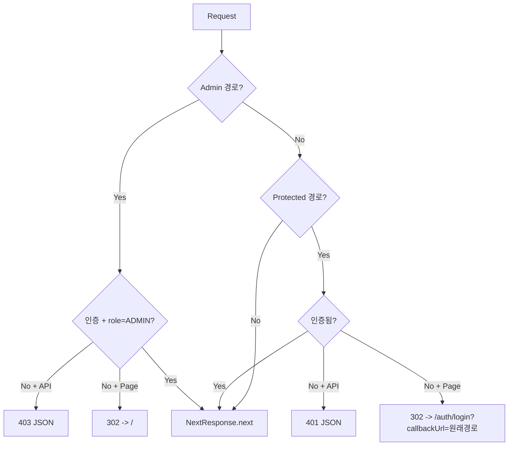

**Protected Routes** (`isProtectedRoute`):
- `/watchlist`, `/settings`, `/mypage`
- `/api/watchlist`, `/api/portfolio`
- `/reports/stock`
- `/board/new`, `/board/[id]/edit` (정규식: `/^\/board\/[^/]+\/edit$/`)

**Matcher** (`config.matcher`):
```
/watchlist/:path*, /portfolio/:path*, /settings/:path*, /mypage/:path*
/api/watchlist/:path*, /api/portfolio/:path*
/reports/stock/:path*
/board/new, /board/:id/edit
/admin/:path*, /api/admin/:path*
```

> **주의**: `/portfolio/:path*`가 matcher에 포함되어 있으나, `isProtectedRoute`에는 `/portfolio`가 **미포함** (비대칭). 또한 `/portfolio` 페이지 자체가 존재하지 않아 404 발생. ([알려진 이슈 M-2](#m-2-portfolio-404) 참조)

---

## 3. 사용자 여정 Flow

### 3.1 비로그인 사용자

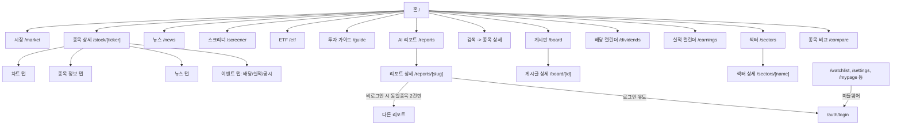

**비로그인 접근 가능 페이지:**

| 카테고리 | 페이지 | 제한 사항 |
|----------|--------|-----------|
| 홈 | `/` | 비로그인 시 HeroSection + CTA 배너 노출 |
| 시장 | `/market` | 없음 |
| 종목 상세 | `/stock/[ticker]` | 없음 |
| ETF | `/etf`, `/etf/[ticker]` | 없음 |
| 뉴스 | `/news` | 없음 |
| 스크리너 | `/screener`, `/screener/[signal]` | 없음 |
| AI 리포트 | `/reports`, `/reports/[slug]` | 동일 종목 다른 리포트 **2건** 제한 |
| 배당 | `/dividends` | 없음 |
| 실적 | `/earnings` | 없음 |
| 섹터 | `/sectors`, `/sectors/[name]` | 없음 |
| 비교 | `/compare` | 없음 |
| 게시판 | `/board`, `/board/[id]` | 비공개 글 열람 불가, 글 작성 불가 |
| 가이드 | `/guide`, `/guide/*` (5개 하위) | 없음 |
| 정보 | `/about`, `/contact`, `/privacy`, `/terms` | 없음 |

**홈페이지 비로그인 조건부 UI:**
- `HeroSection`: 비로그인 + 미방문(`localStorage "sv_visited"`) 시 표시. 스크리너/AI 리포트/배당 캘린더 3개 기능 카드. 닫기 시 `localStorage`에 영구 저장.
- CTA 배너: "투자 가이드 보기"(`/guide`) + "무료 회원가입"(`/auth/register`)

### 3.2 회원가입/로그인

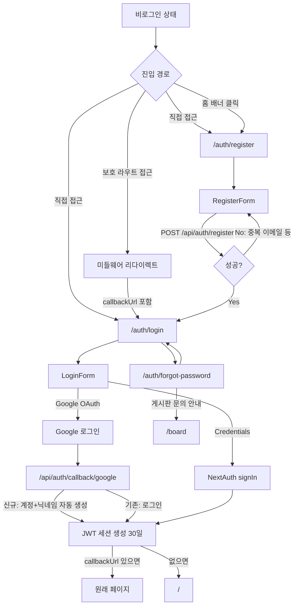

**인증 상세:**
- **Credentials**: 이메일 + 비밀번호 (bcryptjs salt:12, Zod 검증)
- **Google OAuth**: `allowDangerousEmailAccountLinking: true` -- 같은 이메일이면 기존 계정에 연결
- **세션**: JWT 전략, 30일 유효, `token.id` + `token.role` 포함
- **비밀번호 찾기**: 이메일 재설정 미구현 -> 게시판 문의로 안내

### 3.3 종목 탐색 (마켓 -> 검색 -> 종목상세 -> 차트)

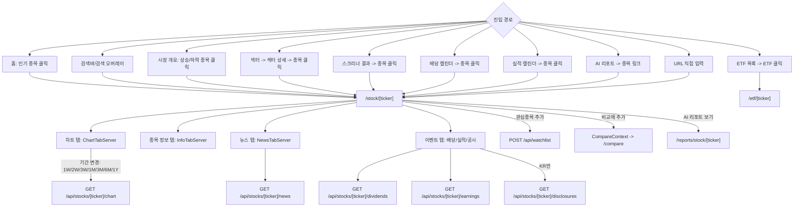

**종목 상세 페이지 (`/stock/[ticker]`):**
- Server Component + ISR 15분
- `generateStaticParams`: 최근 업데이트 50개 종목 프리빌드 (`dynamicParams=true`)
- React Query `prefetchQuery`로 차트 데이터 서버 프리페치
- `StockTabs` 컴포넌트: 차트/정보/뉴스/이벤트 탭 (클라이언트 탭 전환)
- 각 탭은 Suspense로 감싸져 독립 로딩
- 이벤트 탭: KR -> 배당+실적+공시, US -> 배당+실적
- SEO: Breadcrumb, FinancialProduct JsonLd, 동적 메타데이터 (종목명+가격)

**ETF 상세 페이지 (`/etf/[ticker]`):**
- Stock 상세와 동일한 `StockTabs` 컴포넌트 재사용
- 공시 탭 없음 (`disclosureSlot={null}`)
- Breadcrumb 경로: ETF > [종목명]

### 3.4 관심종목/포트폴리오

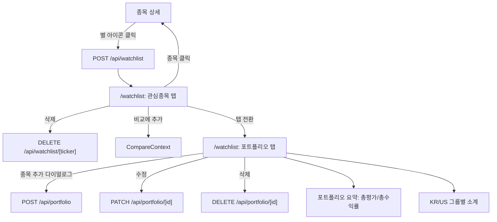

**관심종목 페이지 (`/watchlist`):**
- 클라이언트 컴포넌트 (`"use client"`)
- **이중 인증 보호**: (1) `proxy.ts` 미들웨어가 미인증 시 `/auth/login?callbackUrl=/watchlist`로 리다이렉트 (1차), (2) `useSession()` 컴포넌트 레벨 체크 (2차, 방어적)
- Tabs: 관심종목 / 포트폴리오
- 관심종목: `StockRow` 목록 + 비교 추가 버튼 + 삭제 버튼
- 포트폴리오: `PortfolioSummary` + KR/US 그룹 분리 + `AddPortfolioDialog`
- React Query: `["watchlist"]` (staleTime 1분), `["portfolio"]` (staleTime 1분)

> **주의**: 네비게이션의 `/portfolio` 링크는 **404**를 반환한다. 실제 포트폴리오 기능은 `/watchlist` 페이지 내 탭으로 존재. ([알려진 이슈 M-2](#m-2-portfolio-404) 참조)

### 3.5 뉴스

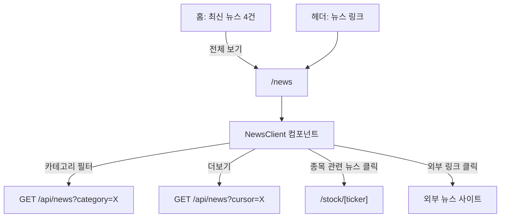

**뉴스 페이지 (`/news`):**
- Server Component + ISR 5분 -> 초기 10건 서버 렌더링
- `NewsClient` (클라이언트): 카테고리 필터, 무한 스크롤
- `NewsCard`: compact/default variant
- 카테고리: DB ENUM 기준 `KR_MARKET`, `US_MARKET`, `INDUSTRY`, `ECONOMY` (4종)

### 3.6 AI 리포트 (생성 파이프라인 포함)

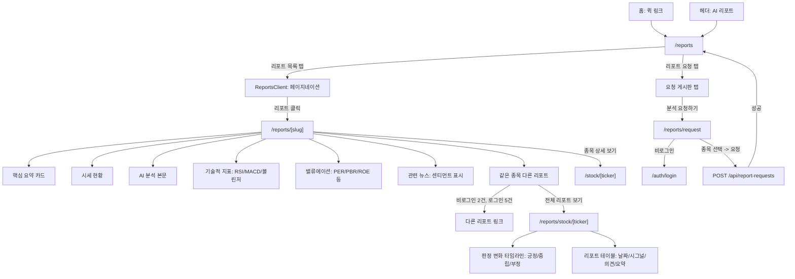

**AI 리포트 생성 파이프라인:**

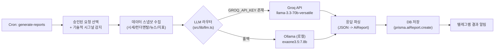

- **LLM 라우터** (`src/lib/llm.ts`): `GROQ_API_KEY` 환경변수 존재 시 Groq 사용, 미설정 시 Ollama 폴백
- **Groq** (`src/lib/groq.ts`): `llama-3.3-70b-versatile` (기본), `GROQ_MODEL` 환경변수로 변경 가능
- **Ollama** (`src/lib/ollama.ts`): `exaone3.5:7.8b` (기본), 로컬 `http://localhost:11434`
- **리포트 요청 상태 전이**: `PENDING` -> `APPROVED` -> `GENERATING` -> `COMPLETED`/`FAILED`, 또는 `PENDING` -> `REJECTED`
- **요청 제한**: 하루 최대 3건, 진행 중인 종목 중복 불가

### 3.7 게시판

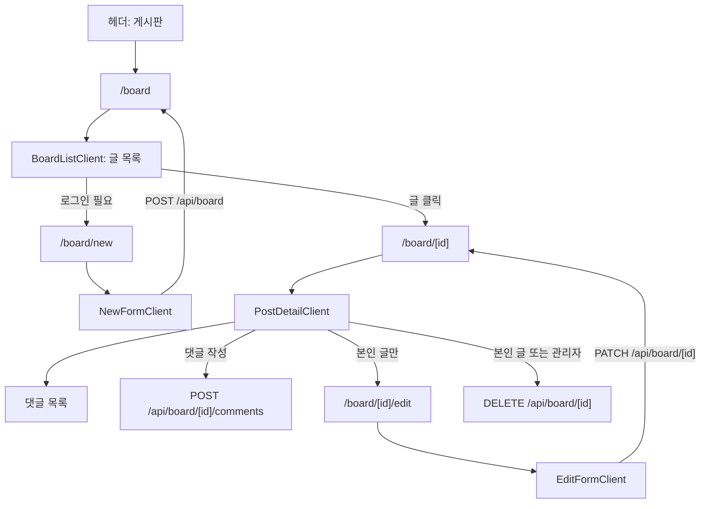

**게시판 권한 체계:**

| 동작 | 비로그인 | 로그인 (일반) | 로그인 (작성자) | 관리자 |
|------|---------|-------------|---------------|--------|
| 글 목록 | 공개 글만 | 공개 글 + 본인 비공개 글 | 동일 | **전체** |
| 글 작성 | X (미들웨어 보호) | O | O | O |
| 글 수정 | X | X | **O** | **X** (canEditPost 미포함) |
| 글 삭제 | X | X | O | **O** (canDeletePost 포함) |
| 비공개 글 열람 | X | X | O (본인 글) | O |

> **주의**: `canEditPost`는 작성자만 허용하고 관리자를 포함하지 않는 반면, `canDeletePost`는 관리자를 포함한다. 이 비대칭은 의도적 설계이거나 코드 버그이다. ([알려진 이슈 M-6](#m-6-caneditpost-비대칭) 참조)

### 3.8 종목 비교

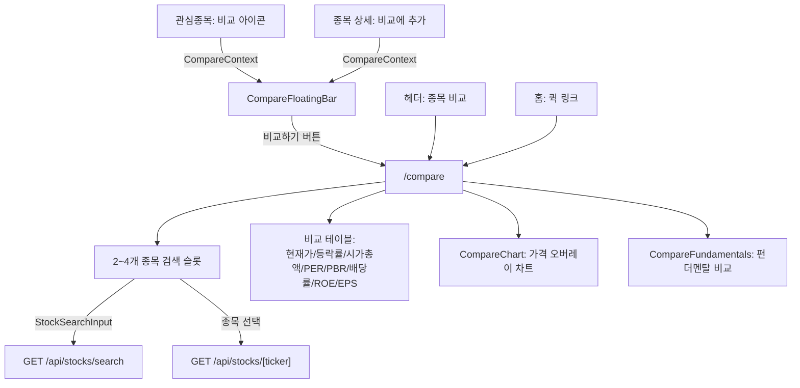

**CompareContext:**
- 전역 상태 (`useReducer` + `sessionStorage` 지속)
- **최대 4종목** (`MAX_SLOTS = 4`, `src/contexts/compare-context.tsx:21` 및 `src/app/compare/page.tsx:90`)
- 관심종목 페이지, 종목 상세 등 어디서든 추가 가능

> **주의**: 홈페이지 QuickLinkCard에서 "최대 5종목 비교 분석"이라 표기하지만, 실제 코드는 4종목 제한. ([알려진 이슈 M-1](#m-1-max_slots-불일치) 참조)

### 3.9 설정

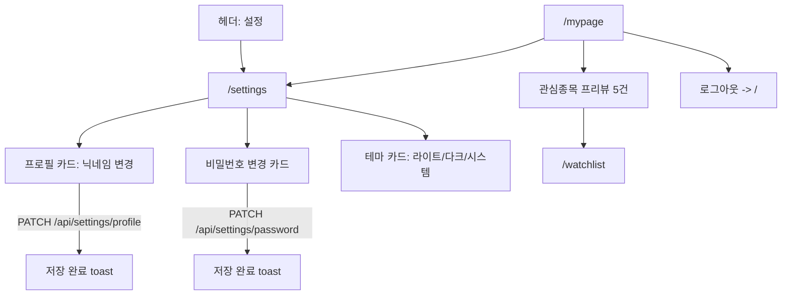

**마이페이지 (`/mypage`):** 클라이언트 컴포넌트. 프로필 카드 (아바타, 이름, 이메일), 관심종목 프리뷰 (최대 5건), 퀵 링크 (관심종목 관리, 설정, 로그아웃)

**설정 (`/settings`):** 클라이언트 컴포넌트, react-hook-form + Zod 폼 검증. 프로필: 이메일(읽기전용) + 닉네임(2~20자). 비밀번호: 현재 비밀번호 + 새 비밀번호(8자 이상) + 확인. 테마: 라이트/다크/시스템.

---

## 4. 페이지 인벤토리

### 4.1 전체 페이지 목록 (39개)

| # | URL | 렌더링 | ISR/동적 | 인증 수준 | 주요 컴포넌트 |
|---|-----|--------|----------|-----------|--------------|
| 1 | `/` | Server | ISR 15분 | 공개 | HeroSection, CompactIndexBar, IndexCard, PopularStocksTabs, NewsCard, QuickLinkCard |
| 2 | `/market` | Server | ISR 15분 | 공개 | IndexCard, ExchangeRateBadge, MarketFilterChips |
| 3 | `/stock/[ticker]` | Server | ISR 15분 + SSG 50개 | 공개 | StockTabs, ChartTabServer, InfoTabServer, NewsTabServer, EventsTabWrapper |
| 4 | `/etf` | Server | ISR 15분 | 공개 | StockRow, Tabs (KR/US) |
| 5 | `/etf/[ticker]` | Server | ISR 15분 + SSG 50개 | 공개 | StockTabs (공시 탭 없음) |
| 6 | `/news` | Server | ISR 5분 | 공개 | NewsClient |
| 7 | `/screener` | Server | 동적 | 공개 | ScreenerClient |
| 8 | `/screener/[signal]` | Server | ISR 15분 + SSG 5개 | 공개 | 시그널별 종목 테이블 |
| 9 | `/reports` | Server | ISR 15분 | 공개 | ReportsPageTabs, ReportsClient |
| 10 | `/reports/[slug]` | Server | ISR 15분 + SSG 50개 | 공개 | MetricCard, TechnicalCard, ValuationRow |
| 11 | `/reports/request` | Client | 동적 | 로그인 (컴포넌트) | StockSearchInput, 요청 폼 |
| 12 | `/reports/stock/[ticker]` | Server | ISR 15분 | **보호 (미들웨어)** | 타임라인, 리포트 테이블 |
| 13 | `/compare` | Client | 동적 | 공개 | StockSearchInput, CompareChart, CompareFundamentals |
| 14 | `/sectors` | Server | ISR 1시간 | 공개 | SectorList |
| 15 | `/sectors/[name]` | Server | ISR 1시간 + SSG 전체 | 공개 | 종목 테이블 |
| 16 | `/dividends` | Server | ISR 1시간 | 공개 | DividendTable, HighDividendSection |
| 17 | `/earnings` | Server | ISR 1시간 | 공개 | EarningsTable, BeatBadge |
| 18 | `/watchlist` | Client | 동적 | **보호 (미들웨어+컴포넌트 이중)** | StockRow, Tabs, PortfolioSummary, AddPortfolioDialog |
| 19 | `/mypage` | Client | 동적 | **보호 (미들웨어)** | 프로필 카드, 관심종목 프리뷰 |
| 20 | `/settings` | Client | 동적 | **보호 (미들웨어)** | react-hook-form, zodResolver |
| 21 | `/board` | Server | 동적 | 공개 | BoardListClient |
| 22 | `/board/[id]` | Server | 동적 | 공개 (비공개 글 제한) | PostDetailClient |
| 23 | `/board/new` | Server | 동적 | **보호 (미들웨어)** | NewFormClient |
| 24 | `/board/[id]/edit` | Server | 동적 | **보호 (미들웨어)** | EditFormClient |
| 25 | `/guide` | Server | 정적 | 공개 | 가이드 카드 그리드 |
| 26 | `/guide/technical-indicators` | Server | 정적 | 공개 | 기술적 지표 가이드 |
| 27 | `/guide/dividend-investing` | Server | 정적 | 공개 | 배당 투자 가이드 |
| 28 | `/guide/etf-basics` | Server | 정적 | 공개 | ETF 기초 가이드 |
| 29 | `/guide/reading-financials` | Server | 정적 | 공개 | 재무제표 읽기 가이드 |
| 30 | `/guide/market-indices` | Server | 정적 | 공개 | 주요 지수 가이드 |
| 31 | `/about` | Server | 정적 | 공개 | 서비스 소개, 면책 고지 |
| 32 | `/contact` | Server | 정적 + Client Form | 공개 | 문의 양식 + FAQ |
| 33 | `/privacy` | Server | 정적 | 공개 | 개인정보처리방침 |
| 34 | `/terms` | Server | 정적 | 공개 | 이용약관 |
| 35 | `/auth/login` | Server | 동적 | 공개 | LoginForm |
| 36 | `/auth/register` | Server | 동적 | 공개 | RegisterForm |
| 37 | `/auth/forgot-password` | Server | 정적 | 공개 | 게시판 문의 안내 |
| 38 | `/admin/contacts` | Client | 동적 | **관리자** | 문의 관리 |
| 39 | `/admin/data-health` | Client | 동적 | **관리자** | 데이터 품질 모니터링 |

### 4.2 Loading / Error 바운더리

| 경로 | loading.tsx | error.tsx |
|------|-----------|-----------|
| `/` (root) | - | `src/app/error.tsx` (글로벌) |
| `/market` | `src/app/market/loading.tsx` | `src/app/market/error.tsx` |
| `/stock/[ticker]` | `src/app/stock/[ticker]/loading.tsx` | `src/app/stock/[ticker]/error.tsx` |
| `/etf` | `src/app/etf/loading.tsx` | - |
| `/etf/[ticker]` | `src/app/etf/[ticker]/loading.tsx` | - |
| `/news` | `src/app/news/loading.tsx` | `src/app/news/error.tsx` |
| `/screener` | `src/app/screener/loading.tsx` | - |
| `/watchlist` | `src/app/watchlist/loading.tsx` | - |

**not-found.tsx**: `src/app/not-found.tsx` (글로벌 404 페이지)

**`notFound()` 트리거 조건** (6곳):
1. `/board/[id]/edit` -- 미인증 시, `canEditPost` 실패 시
2. `/board/[id]` -- 게시글 미존재 시
3. `/reports/[slug]` -- 리포트 미존재 시
4. `/reports/stock/[ticker]` -- 종목 미존재 시
5. `/screener/[signal]` -- 유효하지 않은 시그널 시 (`dynamicParams = false`)

### 4.3 특수 라우트 파일

| 파일 | 역할 |
|------|------|
| `src/app/sitemap.ts` | 기본 사이트맵 (정적 경로 + 동적 종목, revalidate 3600) |
| `src/app/sitemap-index.xml/route.ts` | Sitemap 인덱스 |
| `src/app/sitemap-stocks.xml/route.ts` | 종목 사이트맵 |
| `src/app/sitemap-etf.xml/route.ts` | ETF 사이트맵 |
| `src/app/sitemap-reports.xml/route.ts` | AI 리포트 사이트맵 |
| `src/app/robots.ts` | robots.txt 생성 (API, auth, settings, watchlist, admin, mypage 차단) |
| `src/app/stock/[ticker]/opengraph-image.tsx` | 종목 OG 이미지 |
| `src/app/etf/[ticker]/opengraph-image.tsx` | ETF OG 이미지 |

### 4.4 generateStaticParams 상세

| 페이지 | 생성 조건 | dynamicParams |
|--------|----------|---------------|
| `/stock/[ticker]` | 최근 업데이트 상위 50 종목 | `true` (미생성 경로도 허용) |
| `/etf/[ticker]` | 최근 업데이트 상위 50 ETF | `true` |
| `/reports/[slug]` | 30일 이내 최신 50건 | `true` (기본값) |
| `/screener/[signal]` | 5개 시그널 (golden-cross, rsi-oversold, volume-surge, bollinger-bounce, macd-cross) | **`false`** (미생성 경로 404) |
| `/sectors/[name]` | 전체 섹터 | `true` |

---

## 5. API 인벤토리

### 5.1 공개 API

| 엔드포인트 | Method | 설명 |
|-----------|--------|------|
| `/api/auth/[...nextauth]` | GET, POST | NextAuth 핸들러 (로그인/로그아웃/세션/콜백) |
| `/api/auth/register` | POST | 회원가입 (이메일, 비밀번호, 닉네임) |
| `/api/stocks/search` | GET | 종목 검색 (`q` 파라미터) |
| `/api/stocks/popular` | GET | 인기 종목 (`market`, `limit`) |
| `/api/stocks/[ticker]` | GET | 종목 상세 정보 |
| `/api/stocks/[ticker]/chart` | GET | OHLCV 차트 데이터 (`period` 파라미터) |
| `/api/stocks/[ticker]/news` | GET | 종목 관련 뉴스 |
| `/api/stocks/[ticker]/dividends` | GET | 배당 이력 |
| `/api/stocks/[ticker]/earnings` | GET | 실적 이력 |
| `/api/stocks/[ticker]/disclosures` | GET | 공시 목록 (KR만) |
| `/api/stocks/[ticker]/peers` | GET | 동종업계 종목 |
| `/api/stocks/[ticker]/institutional` | GET | 기관 매매 동향 |
| `/api/stocks/[ticker]/fundamental-history` | GET | 펀더멘탈 히스토리 |
| `/api/market/indices` | GET | 시장 지수 (KOSPI, KOSDAQ, SPX, IXIC) |
| `/api/market/exchange-rate` | GET | USD/KRW 환율 |
| `/api/market/kr/movers` | GET | 한국 상승/하락 종목 |
| `/api/market/us/movers` | GET | 미국 상승/하락 종목 |
| `/api/market/sectors` | GET | 섹터 목록 |
| `/api/market/sectors/[name]/stocks` | GET | 섹터별 종목 |
| `/api/market-indices/history` | GET | 지수 히스토리 (스파크라인) |
| `/api/etf/popular` | GET | 인기 ETF (`market`, `limit`) |
| `/api/news` | GET | 뉴스 목록 (카테고리, 페이징) |
| `/api/news/latest` | GET | 최신 뉴스 (`limit`) |
| `/api/screener` | GET | 기술적 스크리너 (`market`, `signal`) |
| `/api/screener/fundamental` | GET | 펀더멘탈 스크리너 |
| `/api/sectors` | GET | 섹터 데이터 |
| `/api/reports` | GET | AI 리포트 목록 |
| `/api/reports/[slug]` | GET | AI 리포트 상세 |
| `/api/contact` | POST | 문의 등록 (비로그인 가능) |

### 5.2 인증 API

| 엔드포인트 | Method | 권한 | 설명 |
|-----------|--------|------|------|
| `/api/watchlist` | GET | 로그인 | 관심종목 목록 (최신 시세 포함) |
| `/api/watchlist` | POST | 로그인 | 관심종목 추가 (ticker) |
| `/api/watchlist/[ticker]` | DELETE | 로그인 | 관심종목 삭제 |
| `/api/portfolio` | GET | 로그인 | 포트폴리오 목록 + 수익률 요약 |
| `/api/portfolio` | POST | 로그인 | 포트폴리오 종목 추가 (ticker, quantity, avgPrice) |
| `/api/portfolio/[id]` | PATCH | 로그인 | 포트폴리오 항목 수정 |
| `/api/portfolio/[id]` | DELETE | 로그인 | 포트폴리오 항목 삭제 |
| `/api/settings/profile` | PATCH | 로그인 | 닉네임 변경 |
| `/api/settings/password` | PATCH | 로그인 | 비밀번호 변경 (현재 비밀번호 확인) |
| `/api/board` | GET | 부분 | 게시글 목록 (비밀글 필터링) |
| `/api/board` | POST | 로그인 | 게시글 작성 (title, content, isPrivate) |
| `/api/board/[id]` | GET | 부분 | 게시글 상세 (조회수 증가) |
| `/api/board/[id]` | PATCH | 작성자 | 게시글 수정 (`canEditPost`: 작성자만, 관리자 미포함) |
| `/api/board/[id]` | DELETE | 작성자/관리자 | 게시글 삭제 (`canDeletePost`: 관리자 포함) |
| `/api/board/[id]/comments` | GET | 부분 | 댓글 목록 |
| `/api/board/[id]/comments` | POST | 로그인 | 댓글 작성 |
| `/api/board/comments/[commentId]` | PATCH | 작성자 | 댓글 수정 |
| `/api/board/comments/[commentId]` | DELETE | 작성자/관리자 | 댓글 삭제 |
| `/api/report-requests` | GET | 선택 | 리포트 요청 목록 |
| `/api/report-requests` | POST | 로그인 | 리포트 요청 생성 (하루 3건, 중복 불가) |
| `/api/report-requests/[id]` | PATCH | **관리자** | 요청 상태 변경 (승인/반려) |
| `/api/report-requests/[id]` | DELETE | 관리자 | 요청 삭제 |
| `/api/report-requests/[id]/comments` | GET, POST | 로그인 | 요청 댓글 |

### 5.3 관리자 API

| 엔드포인트 | Method | 설명 |
|-----------|--------|------|
| `/api/admin/contacts` | GET | 문의 목록 조회 (페이지네이션) |
| `/api/admin/data-health` | GET | 데이터 품질 모니터링 (종목/뉴스/지표/크론 로그) |

### 5.4 Cron API (`CRON_SECRET` Bearer 토큰 인증)

| 엔드포인트 | Method | maxDuration | 설명 |
|-----------|--------|-------------|------|
| `/api/cron/collect-master` | POST | 60s | 종목 마스터 싱크 (주간) |
| `/api/cron/collect-kr-quotes` | POST | 55s | 한국 시세 수집 (평일) |
| `/api/cron/collect-us-quotes` | POST | 60s | 미국 시세 수집 (평일) |
| `/api/cron/collect-exchange-rate` | POST | 60s | 환율 수집 |
| `/api/cron/collect-news` | POST | 60s | 뉴스 수집 (매일) |
| `/api/cron/collect-fundamentals` | POST | 60s | 펀더멘탈 데이터 수집 |
| `/api/cron/collect-institutional` | POST | 60s | 기관 매매 동향 수집 |
| `/api/cron/collect-events` | POST | 60s | 배당/실적 이벤트 수집 |
| `/api/cron/collect-dart-dividends` | POST | 300s | DART 배당 데이터 수집 |
| `/api/cron/collect-disclosures` | POST | 60s | 공시 수집 |
| `/api/cron/sync-corp-codes` | POST | 120s | DART 법인코드 싱크 |
| `/api/cron/sync-kr-sectors` | POST | 60s | 한국 섹터 분류 싱크 |
| `/api/cron/analyze-sentiment` | POST | 60s | 뉴스 센티먼트 분석 (Groq) |
| `/api/cron/generate-reports` | POST | 60s | AI 리포트 자동 생성 |
| `/api/cron/cleanup` | POST | 60s | 오래된 데이터 정리 (21일+/90일+) |

---

## 6. 데이터 Flow

### 6.1 외부 데이터 소스 -> Cron -> DB -> App 파이프라인

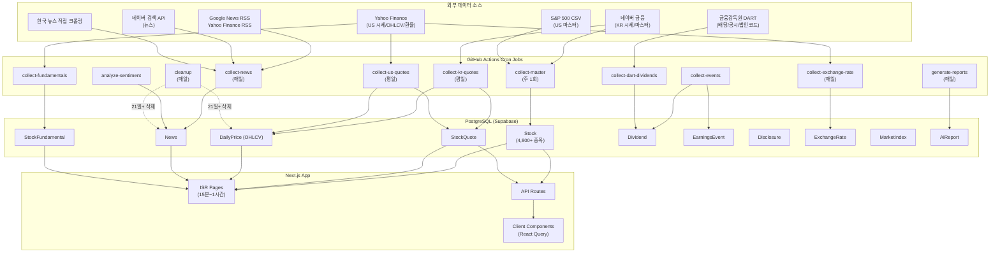

### 6.2 뉴스 수집 파이프라인 (4개 소스)

| 소스 | 파일 | 수집 방식 |
|------|------|----------|
| Google News RSS | `src/lib/data-sources/news-rss.ts` | RSS 피드 파싱 |
| Yahoo Finance RSS | `src/lib/data-sources/news-rss.ts` | RSS 피드 파싱 |
| 한국 뉴스 직접 크롤링 | `src/lib/data-sources/news-kr-direct.ts` | HTML 크롤링 |
| 네이버 검색 API | `src/lib/data-sources/news-naver-search.ts` | `NAVER_CLIENT_ID`/`SECRET` 사용 |

- 종목별 뉴스 매칭: `src/lib/data-sources/news-stock-specific.ts`
- 감성 분석: `src/lib/utils/news-sentiment.ts` (Groq 기반)
- 기사 본문 추출: `src/lib/utils/article-extractor.ts` (@mozilla/readability + jsdom)
- 자동 카테고리 분류: 키워드 기반, DB ENUM 4종 (`KR_MARKET`, `US_MARKET`, `INDUSTRY`, `ECONOMY`)

### 6.3 텔레그램 알림 시스템

`src/lib/utils/telegram.ts`를 통해 Cron 실행 결과를 Telegram Bot으로 알림 전송.

- 환경변수: `TELEGRAM_BOT_TOKEN`, `TELEGRAM_CHAT_ID`
- 심각도 레벨: `info`, `warning`, `error`
- 사용처: `collect-kr-quotes`, `collect-institutional`, `collect-fundamentals`, `analyze-sentiment`, `report-requests` 등 5개 이상 Cron API
- 미설정 시 경고 로그만 출력하고 스킵

---

## 7. 상태 관리 패턴

### 7.1 Server vs Client Component 분류

| 패턴 | 페이지 | 특징 |
|------|--------|------|
| **Pure Server** | 홈, 시장, 종목 상세, ETF, 뉴스, 스크리너, 섹터, 리포트, 배당, 실적, 게시판, 가이드, 정보 | Prisma 직접 쿼리, ISR, `generateStaticParams` |
| **Pure Client** | 관심종목, 비교, 설정, 마이페이지, 관리자, 리포트 요청 | `"use client"`, React Query, `useSession` |
| **Hybrid** | 종목 상세 (Server + Client StockTabs) | 서버 프리페치 -> `HydrationBoundary` -> 클라이언트 탭 전환 |

### 7.2 QueryClient 전역 설정 (`src/components/providers.tsx`)

| 옵션 | 값 |
|------|-----|
| `staleTime` (기본) | 5분 (300,000ms) |
| `gcTime` (기본) | 30분 (1,800,000ms) |
| `retry` | 1회 |

**컴포넌트별 staleTime 오버라이드:**

| 컴포넌트 | staleTime | 이유 |
|----------|----------|------|
| `use-chart-data.ts` | **24시간** | 차트 데이터는 ISR(15분) 기반이므로 빈번한 재요청 불필요 |
| `watchlist/page.tsx` | **1분** | 관심종목 시세는 자주 변동 |
| `mypage/page.tsx` | **1분** | 관심종목 프리뷰도 동일 |
| `screener-client.tsx` | **15분** | 스크리너 결과는 ISR과 동기화 |
| `peer-stocks.tsx` | **30분** | 동종업계 데이터는 변동 빈도 낮음 |

### 7.3 React Query 키 목록

| queryKey | 페이지 | API |
|----------|--------|-----|
| `["watchlist"]` | 관심종목, 마이페이지 | `GET /api/watchlist` |
| `["portfolio"]` | 관심종목 (포트폴리오 탭) | `GET /api/portfolio` |
| `["chart", ticker, period]` | 종목 상세 | `GET /api/stocks/[ticker]/chart` |
| `["compare", ticker]` | 비교 | `GET /api/stocks/[ticker]` |
| `["screener", market, signal]` | 스크리너 | `GET /api/screener` |
| `["stock-search-prefill", ticker]` | 리포트 요청 | URL 파라미터로 종목 자동 선택 |

### 7.4 URL State (searchParams) 사용

| 페이지 | 파라미터 | 용도 |
|--------|---------|------|
| `/auth/login` | `callbackUrl` | 로그인 후 리다이렉트 |
| `/reports/request` | `ticker` | 종목 자동 선택 |
| `/reports` | `tab=requests` | 요청 탭 활성화 |

### 7.5 전역 상태

| 상태 | 관리 방식 | 지속성 |
|------|----------|--------|
| 인증 세션 | `SessionProvider` (NextAuth JWT) | 30일 |
| React Query 캐시 | `QueryClientProvider` | 메모리 (gcTime 30분) |
| 테마 | `ThemeProvider` (next-themes) | localStorage |
| 비교 종목 | `CompareProvider` (useReducer) | sessionStorage |
| 토스트 알림 | `Toaster` (sonner) | 일시적 |
| HeroSection 닫기 | localStorage (`sv_visited`) | 영구 |
| 쿠키 동의 | localStorage | 영구 |

---

## 8. 차트 시스템 상세

### 8.1 기간 옵션 (7개)

`ChartPeriod` (`src/types/stock.ts:66`):

| 코드 | 라벨 |
|------|------|
| `1W` | 1주 |
| `2W` | 2주 |
| `3W` | 3주 |
| `1M` | 1개월 |
| `3M` | 3개월 |
| `6M` | 6개월 |
| `1Y` | 1년 |

### 8.2 차트 타입

| 타입 | 설명 |
|------|------|
| 캔들스틱 | 기본 OHLCV 캔들 |
| Heikin-Ashi | `calculateHeikinAshi` 함수로 변환 (토글: `showHA`) |

### 8.3 이동평균선 (`MAType`)

`"off"` | `"SMA"` (단순 이동평균) | `"EMA"` (지수 이동평균)

### 8.4 보조지표 패널 (9개)

`IndicatorPanel` (`src/components/stock/chart-controls.tsx:18`):

| 지표 | 설명 |
|------|------|
| MACD | 이동평균 수렴/발산 |
| RSI | 상대강도지수 |
| Stochastic | 스토캐스틱 오실레이터 |
| OBV | 거래량 균형 |
| ATR | 평균 진폭 |
| ROC | 변화율 |
| MFI | 자금흐름지수 |
| ADLine | 축적/분배선 |
| ADX | 평균 방향성 지수 |

### 8.5 오버레이 (6개)

| 키 | 라벨 | 설명 |
|----|------|------|
| `showBB` | BB | 볼린저 밴드: 이동평균 +/- 표준편차 |
| `showKC` | KC | 켈트너 채널: EMA +/- ATR |
| `showPivot` | Pivot | 피봇 포인트: 전일 고/저/종가 기반 지지/저항선 |
| `showFib` | Fib | 피보나치 되돌림: 23.6%~78.6% 구간 |
| `showSAR` | SAR | 파라볼릭 SAR: 추세 반전 포인트 |
| `showPatterns` | 패턴 | 캔들 패턴: 도지, 망치형, 장악형 등 10가지 반전 패턴 감지 |

---

## 9. 시스템 설정

### 9.1 환경변수 전체 목록

#### DB / 인프라

| 변수명 | 용도 | 필수 |
|--------|------|------|
| `DATABASE_URL` | DB 연결 (Supabase pooler) | O |
| `DIRECT_URL` | DB 직접 연결 (마이그레이션용) | O |
| `NEXTAUTH_SECRET` | JWT 비밀키 | O |
| `NEXTAUTH_URL` | NextAuth 기본 URL | O |
| `APP_URL` | 앱 기본 URL (sitemap 등) | O |
| `CRON_SECRET` | Cron API Bearer 토큰 | O |

#### 인증 (OAuth)

| 변수명 | 용도 | 필수 |
|--------|------|------|
| `AUTH_GOOGLE_ID` | Google OAuth 클라이언트 ID | Google 로그인 사용 시 |
| `AUTH_GOOGLE_SECRET` | Google OAuth 클라이언트 Secret | Google 로그인 사용 시 |

#### AI / LLM

| 변수명 | 용도 | 필수 |
|--------|------|------|
| `GROQ_API_KEY` | Groq API 키 | AI 리포트 생성 시 (우선) |
| `GROQ_MODEL` | Groq 모델명 (기본: `llama-3.3-70b-versatile`) | 선택 |
| `OLLAMA_URL` | Ollama 서버 URL (기본: `http://localhost:11434`) | 선택 |
| `OLLAMA_MODEL` | Ollama 모델명 (기본: `exaone3.5:7.8b`) | 선택 |

#### 외부 API

| 변수명 | 용도 | 필수 |
|--------|------|------|
| `OPENDART_API_KEY` | 금감원 DART API | 배당/공시 수집 시 |
| `NAVER_CLIENT_ID` | 네이버 검색 API | 뉴스 수집 시 |
| `NAVER_CLIENT_SECRET` | 네이버 검색 API | 뉴스 수집 시 |

#### 알림

| 변수명 | 용도 | 필수 |
|--------|------|------|
| `TELEGRAM_BOT_TOKEN` | 텔레그램 알림 봇 토큰 | 선택 |
| `TELEGRAM_CHAT_ID` | 텔레그램 채팅 ID | 선택 |

#### 분석 / 광고

| 변수명 | 용도 | 필수 |
|--------|------|------|
| `NEXT_PUBLIC_GTM_ID` | Google Tag Manager ID | 선택 |
| `NEXT_PUBLIC_ADSENSE_ID` | Google AdSense 퍼블리셔 ID | 선택 |

### 9.2 next.config.ts

**보안 헤더** (모든 경로 `/(.*)`에 적용):

| 헤더 | 값 |
|------|-----|
| Content-Security-Policy | `default-src 'self'; script-src 'self' 'unsafe-inline' 'unsafe-eval' ...` |
| X-Content-Type-Options | `nosniff` |
| X-Frame-Options | `SAMEORIGIN` |
| X-XSS-Protection | `1; mode=block` |
| Referrer-Policy | `strict-origin-when-cross-origin` |
| Permissions-Policy | `camera=(), microphone=(), geolocation=()` |

> **보안 주의**: CSP의 `script-src`에 `unsafe-inline`, `unsafe-eval` 포함 (AdSense/GTM 호환 필요). images의 `hostname: "**"` 와일드카드로 모든 외부 이미지 허용.

**기타 설정:**
- `serverExternalPackages`: `@prisma/client`, `prisma`, `pg`, `pg-native`, `pgpass`
- `experimental.serverActions.allowedOrigins`: `["localhost:3000"]` -- 프로덕션에서 Server Actions 차단 가능성 있음
- `experimental.optimizePackageImports`: `lucide-react`, `sonner`, `lightweight-charts`
- redirects/rewrites: **없음** (`/portfolio` -> `/watchlist` 리다이렉트 미설정이 M-2 이슈 원인)

### 9.3 GitHub Actions 워크플로우

**총 16개 워크플로우** (`.github/workflows/`):

**파이프라인 (2개):**
- `cron-pipeline-kr.yml` -- 평일 16:00 KST (07:00 UTC), `cron-kr.yml`을 reusable workflow로 호출
- `cron-pipeline-us.yml` -- 평일 16:15 ET (21:15 UTC), `cron-us.yml`을 reusable workflow로 호출

**개별 워크플로우 (14개):**
- `cron-kr.yml`, `cron-us.yml` -- 시세 수집 reusable workflow
- `cron-cleanup.yml` -- 데이터 정리
- `cron-events.yml`, `cron-disclosures.yml` -- 이벤트/공시 수집
- `cron-fundamentals.yml`, `cron-institutional.yml` -- 펀더멘탈/기관 매매
- `cron-exchange.yml` -- 환율 수집
- `cron-kr-sectors.yml` -- 섹터 싱크
- `cron-master.yml` -- 마스터 데이터 싱크
- `cron-news.yml` -- 뉴스 수집
- `cron-sentiment.yml` -- 감성 분석 (수/토 09:00 UTC)
- `cron-dart-dividends.yml`, `cron-corp-codes.yml` -- DART 연동

### 9.4 데이터 모델 (Prisma 주요 모델)

**20개 모델 + 4개 ENUM:**

| 분류 | 모델 |
|------|------|
| 인증 | User, Account, Session |
| 시세 | Stock, StockQuote, DailyPrice |
| 사용자 데이터 | Watchlist, Portfolio |
| 뉴스 | News, StockNews |
| 지수/환율 | MarketIndex, MarketIndexHistory, ExchangeRate |
| 펀더멘탈 | StockFundamental, FundamentalHistory |
| 이벤트 | Dividend, EarningsEvent, Disclosure |
| AI | AiReport, ReportRequest, RequestComment |
| 게시판 | BoardPost, BoardComment |
| 기타 | Sector, InstitutionalFlow, ContactMessage, CronLog |

**ENUM:**

| ENUM | 값 |
|------|-----|
| `Market` | `KR`, `US` |
| `UserRole` | `USER`, `ADMIN` |
| `StockType` | `STOCK`, `ETF` |
| `NewsCategory` | `KR_MARKET`, `US_MARKET`, `INDUSTRY`, `ECONOMY` |
| `RequestStatus` | `PENDING`, `APPROVED`, `REJECTED`, `GENERATING`, `COMPLETED`, `FAILED` |

### 9.5 SEO 인프라

| 요소 | 구현 |
|------|------|
| 메타데이터 | 모든 페이지 `export const metadata` 또는 `generateMetadata` |
| OG 태그 | 주요 페이지 openGraph 설정 |
| OG 이미지 | `/stock/[ticker]`, `/etf/[ticker]` (동적 생성) |
| JSON-LD | Organization, WebSite, WebPage, FinancialProduct, Article |
| Breadcrumb | 종목, 시장, 뉴스, 스크리너, 섹터, 리포트, 게시판, ETF, 배당, 실적 |
| Canonical | `alternates.canonical` 주요 페이지 설정 |
| Sitemap | 1개 기본 (`sitemap.ts`) + 4개 분할 XML (index, stocks, etf, reports) |
| robots | 인증 페이지 `index: false, follow: false` |
| 검색엔진 인증 | Google Search Console (`verification.google`) + Naver Search Advisor |
| GTM | 모든 페이지 `GtmPageView` 컴포넌트 |
| AdSense | 조건부 스크립트 로드, `ads.txt` 포함 |

### 9.6 광고 슬롯 배치

| 슬롯 ID | 위치 | 포맷 |
|---------|------|------|
| `home-bottom` | 홈 하단 | leaderboard |
| `market-bottom` | 시장 하단 | leaderboard |
| `stock-detail-mid` | 종목 상세 중간 | rectangle |
| `etf-detail-mid` | ETF 상세 중간 | rectangle |
| `etf-bottom` | ETF 목록 하단 | leaderboard |
| `compare-bottom` | 비교 하단 | rectangle |

### 9.7 용어 사전 시스템

- `src/lib/glossary.ts` -- 투자 용어 사전 + 시그널 색상 정의
- `src/components/common/tooltip-helper.tsx` -- 용어 툴팁 UI
- PER, PBR, ROE 등의 용어에 마우스를 올리면 설명 표시

### 9.8 쿠키 동의 (Cookie Consent)

- `src/components/cookie-consent.tsx` -- 쿠키 동의 배너
- GTM consent 기본값: `ad_storage: denied`, `analytics_storage: granted`
- Footer에서 `cookie-consent-reset` 커스텀 이벤트로 재설정 가능
- 동의 후 `localStorage`에 저장

---

## 10. 알려진 이슈 및 개선 필요 사항

### 코드 버그

#### M-1: MAX_SLOTS 불일치

- **위치**: `src/app/page.tsx:208` (UI 텍스트 "최대 5종목"), `src/app/compare/page.tsx:90` + `src/contexts/compare-context.tsx:21` (실제 `MAX_SLOTS = 4`)
- **영향**: 홈페이지에서 "최대 5종목 비교 분석"이라 안내하지만 실제로는 4종목만 가능
- **수정 방안**: (A) 홈페이지 텍스트를 "최대 4종목"으로 변경, 또는 (B) MAX_SLOTS를 5로 변경

#### M-2: /portfolio 404

- **위치**: `src/components/layout/app-header.tsx:56,103` (링크 존재), `src/proxy.ts:41` (matcher 포함), `src/app/portfolio/` (디렉토리 미존재)
- **3중 문제**: (1) 네비게이션 링크 클릭 시 404, (2) matcher에 `/portfolio/:path*` 포함이나 `isProtectedRoute`에는 미포함 (비대칭), (3) 실제 기능은 `/watchlist` 탭에 존재
- **수정 방안**: (A) `/portfolio` -> `/watchlist?tab=portfolio` 리다이렉트 추가 (next.config.ts `redirects`), 또는 (B) 네비게이션 링크를 `/watchlist` 탭 링크로 변경

#### M-6: canEditPost 비대칭

- **위치**: `src/lib/board-permissions.ts:16-18`
- **현상**: `canEditPost`는 **작성자만** 허용 (관리자 미포함), `canDeletePost`는 **작성자+관리자** 허용
- **영향**: 관리자가 타인의 게시글을 삭제할 수는 있지만 수정할 수는 없음
- **수정 방안**: 의도적 설계라면 문서에 명시, 버그라면 `canEditPost`에 `isAdmin` 체크 추가

### 보안 주의 사항

| 항목 | 위치 | 설명 |
|------|------|------|
| serverActions allowedOrigins | `next.config.ts:15-17` | `["localhost:3000"]`만 허용 -- 프로덕션 도메인 추가 필요 |
| images 와일드카드 | `next.config.ts:11` | `hostname: "**"` -- 모든 외부 이미지 허용, 보안 위험 |
| CSP unsafe-eval | `next.config.ts:33` | AdSense/GTM 호환을 위해 허용되었으나, XSS 위험 존재 |

### 문서화 필요 사항

- API Request/Response 스키마 (`src/lib/validations/`의 Zod 스키마 문서화, OpenAPI 별도 문서 권장)
- 각 페이지의 에러 상태 및 빈 상태 UI 정의
- `/reports/request` 인증 방식 (미들웨어 보호 아님, 컴포넌트 레벨 체크만)이 다른 보호 라우트와 다른 패턴

### 미사용 코드

- `src/components/onboarding/onboarding-sheet.tsx` -- 시장/섹터/종목 선택 3단계 온보딩 UI가 구현되어 있으나, 어떤 페이지에서도 import되지 않는 데드 코드. v1.0에서 코드 정리 대상이거나 향후 기능으로 분류.

---

## 부록

### A. 전체 사이트맵 다이어그램

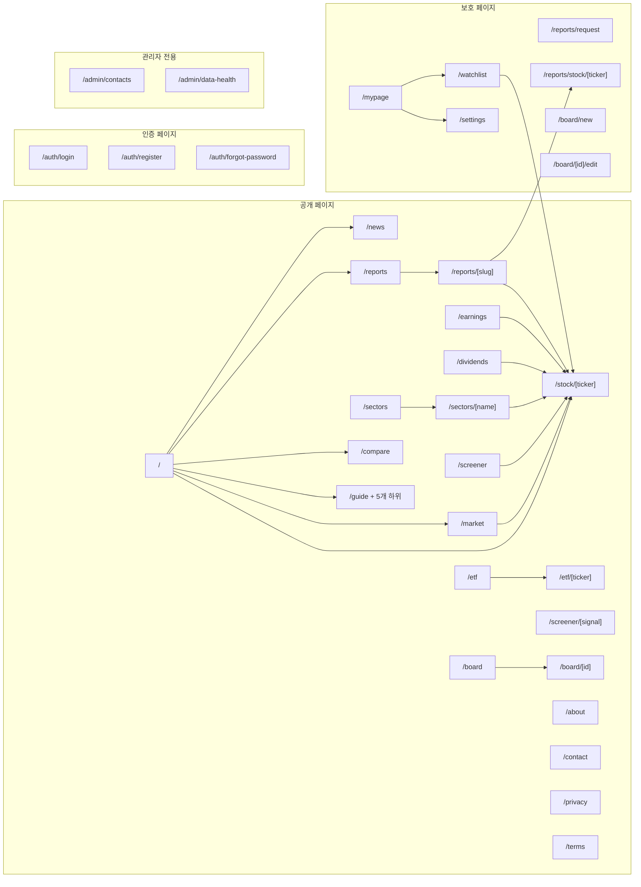

### B. ISR/SSG 전략 요약

| revalidate 값 | 적용 페이지 |
|---------------|-----------|
| **300초 (5분)** | `/news` |
| **900초 (15분)** | `/` (홈), `/market`, `/stock/[ticker]`, `/etf`, `/etf/[ticker]`, `/screener/[signal]`, `/reports`, `/reports/[slug]`, `/reports/stock/[ticker]` |
| **3600초 (1시간)** | `/sectors`, `/sectors/[name]`, `/dividends`, `/earnings` |
| **정적** | `/guide/*`, `/about`, `/contact`, `/privacy`, `/terms`, `/auth/forgot-password` |
| **동적** | `/auth/login`, `/auth/register`, `/screener`, `/board`, `/board/*`, 클라이언트 전용 페이지, 관리자 페이지 |

### C. 컴포넌트 의존성 맵

| 페이지 | 사용 컴포넌트 |
|--------|-------------|
| **홈** (`/`) | HeroSection, CompactIndexBar, IndexCard, IndexSparkline, PopularStocksTabs, NewsCard, QuickLinkCard/Grid, AdSlot |
| **시장** (`/market`) | IndexCard, ExchangeRateBadge, MarketFilterChips, AdSlot |
| **종목 상세** (`/stock/[ticker]`) | StockTabs, ChartTabServer/Client, InfoTabServer, NewsTabServer, EventsTabWrapper, DividendTabServer, EarningsTabServer, DisclosureTabServer, Breadcrumb, JsonLd, AdSlot, AdDisclaimer |
| **ETF 상세** (`/etf/[ticker]`) | StockTabs (공시 탭 없음) |
| **ETF 목록** (`/etf`) | StockRow, Tabs, AdSlot |
| **뉴스** (`/news`) | NewsClient |
| **관심종목** (`/watchlist`) | StockRow, EmptyState, Tabs, PortfolioSummary, PortfolioRow, AddPortfolioDialog |
| **비교** (`/compare`) | StockSearchInput, CompareChart (dynamic), CompareFundamentals (dynamic) |
| **스크리너** (`/screener`) | ScreenerClient, HydrationBoundary |
| **AI 리포트** (`/reports`) | ReportsClient, ReportsPageTabs |
| **리포트 상세** (`/reports/[slug]`) | MetricCard, TechnicalCard, ValuationRow |
| **배당** (`/dividends`) | DividendTable, HighDividendSection |
| **실적** (`/earnings`) | EarningsTable, BeatBadge |
| **게시판** (`/board`) | BoardListClient |
| **게시글 상세** (`/board/[id]`) | PostDetailClient |
| **마이페이지** (`/mypage`) | StockRow, Avatar, Card |
| **설정** (`/settings`) | Card, Input, useForm (react-hook-form + zod) |
| **관리자** (`/admin/*`) | 자체 UI, PageContainer |

**공통 컴포넌트:**

| 컴포넌트 | 사용처 |
|----------|--------|
| `PageContainer` | 거의 모든 페이지 |
| `GtmPageView` | 대부분 페이지 |
| `Breadcrumb` | 시장, 종목, 뉴스, 스크리너, 섹터, 리포트, 게시판 등 |
| `JsonLd` | 홈, 시장, 종목, 뉴스, 리포트, 가이드, 정보 페이지 등 |
| `AdSlot` | 홈, 시장, 종목, ETF, 비교, 스크리너, 배당, 실적 |
| `AdDisclaimer` | 종목 상세, ETF 상세, 리포트, 배당, 실적 |
| `StockRow` | 관심종목, ETF 목록, 마이페이지 |
| `StockSearchInput` | 비교, 리포트 요청 |
| `SearchBar` / `SearchCommand` | 헤더(PC), 모바일 검색 오버레이 |
| `TooltipHelper` | 종목 상세 등 용어 툴팁 |

### D. 검증 이력

본 문서는 다음과 같은 다단계 독립 검증을 거쳐 작성되었다:

| 단계 | 역할 | 산출물 | 주요 발견 |
|------|------|--------|----------|
| 1 | 문서화 A (코드 구조 기반) | `flow-doc-a.md` | 페이지별 상세 Flow, 데이터 파이프라인 |
| 2 | 문서화 B (사용자 여정 기반) | `flow-doc-b.md` | Mermaid 다이어그램, 사이트맵 |
| 3-4 | 교차 검증 2명 | `cross-validation-a.md`, `cross-validation-b.md` | 양쪽 문서 대조 |
| 5-6 | 최종 검증 2명 | `final-verification-1.md`, `final-verification-2.md` | 코드 대조 16건 확인 |
| 7-8 | 교차 검증 재검토 | `verify-cross-1.md`, `verify-cross-2.md` | 검증 결과 교차 확인 |
| 9 | 독립 최종 검증 | `final-sweep.md` | CRITICAL 2건 + MAJOR 5건 + MINOR 9건 + 신규 8건 |
| 10 | 독립 스위핑 2 | `sweep-2.md` | canEditPost 비대칭, 차트 보조지표, Provider 중첩 순서 |
| 11 | 역공학 검증 3 | `sweep-3.md` | 환경변수 9개 누락, AI 파이프라인, 텔레그램, 보안 헤더, GitHub Actions |

**최종 이슈 통계**: CRITICAL 2건 (모두 반영), MAJOR 6건 (모두 반영), MINOR 24건 (주요 항목 반영)
